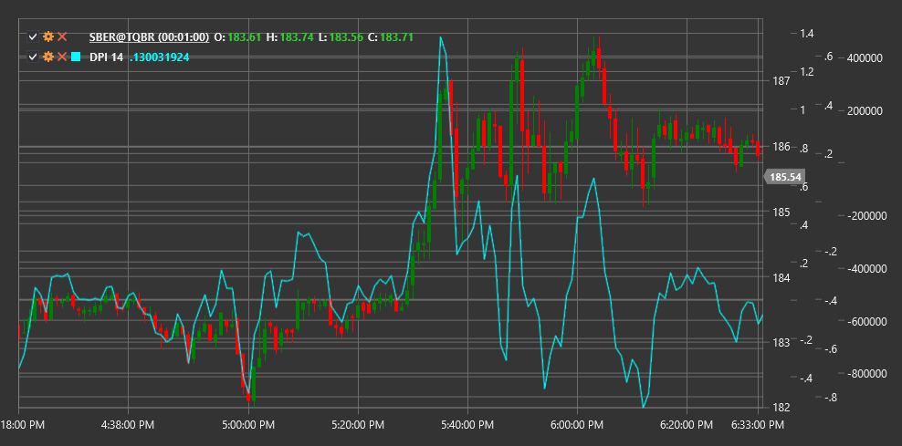

# DPI

**índice de disparidade (DPI)** é um indicador técnico que mede o desvio relativo do preço atual em relação a uma média móvel durante um período especificado, expresso em percentagem.

Para usar o indicador, deve ser usada a classe [DisparityIndex](xref:StockSharp.Algo.Indicators.DisparityIndex).

## Descrição

O índice de disparidade (DPI) foi concebido para medir o grau de desvio do preço em relação à sua média móvel. Este indicador ajuda a determinar até que ponto o preço está "esticado" relativamente ao seu valor médio e pode ser usado para identificar potenciais condições de sobrecompra ou sobrevenda.

O DPI baseia-se na suposição de que o preço tende a regressar ao seu valor médio após um desvio significativo. Quanto maior for o desvio, maior é a probabilidade de um movimento subsequente do preço na direção oposta, aproximando-o da média.

O índice de disparidade é útil para:
- Identificar desvios extremos do preço em relação à sua média
- Detetar potenciais pontos de reversão
- Medir a força da tendência atual
- Criar estratégias de negociação baseadas em reversão à média

## Parâmetros

O indicador tem os seguintes parâmetros:
- **Período** - período para calcular a média móvel (valor predefinido: 14)

## Cálculo

A fórmula de cálculo do índice de disparidade é bastante simples:

```
DPI = ((Price / MA) - 1) * 100
```

Onde:
- Price - preço atual (normalmente o preço de fecho)
- MA - média móvel do preço ao longo do período Length
- O resultado é expresso em percentagem

Valores positivos de DPI indicam que o preço está acima da sua média móvel, enquanto valores negativos indicam que o preço está abaixo da sua média móvel.

## Interpretação

O índice de disparidade pode ser interpretado da seguinte forma:

1. **Níveis extremos**:
   - Valores positivos elevados (por exemplo, acima de +10%) podem indicar condições de sobrecompra no mercado
   - Valores negativos elevados (por exemplo, abaixo de -10%) podem indicar condições de sobrevenda no mercado

2. **Cruzamentos da linha zero**:
   - O cruzamento de baixo para cima (de valores negativos para positivos) indica que o preço cruzou a sua média móvel de baixo para cima, o que pode ser visto como um sinal altista
   - O cruzamento de cima para baixo (de valores positivos para negativos) indica que o preço cruzou a sua média móvel de cima para baixo, o que pode ser visto como um sinal baixista

3. **Divergências**:
   - Divergência altista: o preço atinge um novo mínimo, mas o DPI forma um mínimo mais alto
   - Divergência baixista: o preço atinge um novo máximo, mas o DPI forma um máximo mais baixo

4. **Análise de tendência**:
   - Valores consistentemente positivos de DPI indicam uma forte tendência ascendente
   - Valores consistentemente negativos de DPI indicam uma forte tendência descendente
   - Oscilações em torno de zero podem indicar uma tendência lateral ou consolidação

5. **Estratégias de reversão à média**:
   - Valores extremos de DPI podem ser usados para abrir posições contra o movimento atual do preço, esperando um regresso à média



## Ver também

[SMA](sma.md)
[RSI](rsi.md)
[Oscilador estocástico](stochastic_oscillator.md)
[BollingerBands](bollinger_bands.md)
