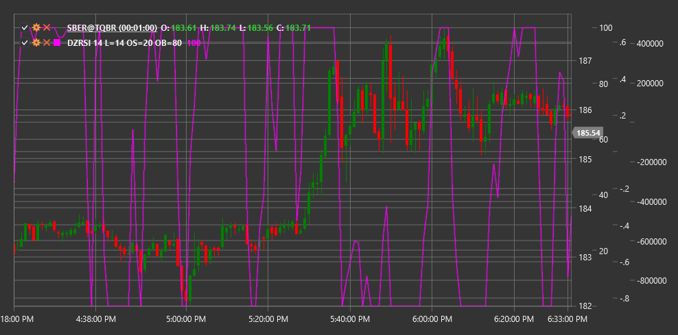

# DZRSI

**Dynamic Zones RSI (DZRSI)** é uma modificação do clássico Relative Strength Index (RSI) que usa níveis de sobrecompra e sobrevenda dinamicamente variáveis em vez de níveis estáticos.

Para usar o indicador, deve ser usada a classe [DynamicZonesRSI](xref:StockSharp.Algo.Indicators.DynamicZonesRSI).

## Descrição

O Dynamic Zones RSI (DZRSI) baseia-se no RSI tradicional, mas com uma melhoria importante: em vez de usar níveis fixos de sobrecompra e sobrevenda (normalmente 70 e 30), o DZRSI adapta estes níveis às condições atuais do mercado.

A ideia principal do DZRSI é que diferentes condições de mercado exigem diferentes limiares para determinar estados de sobrecompra e sobrevenda. Numa forte tendência ascendente, o RSI pode permanecer acima do nível tradicional de sobrecompra de 70 durante um período prolongado sem fornecer sinais precisos de entrada ou saída. De forma semelhante, numa forte tendência descendente, o RSI pode permanecer abaixo do nível de sobrevenda de 30 durante muito tempo.

O DZRSI resolve este problema ajustando dinamicamente estes níveis com base no comportamento histórico do próprio RSI, tornando o indicador mais adaptativo a vários regimes de mercado.

## Parâmetros

O indicador tem os seguintes parâmetros:
- **Length** - período para calcular o RSI base (valor predefinido: 14)
- **OverboughtLevel** - nível inicial de sobrecompra (valor predefinido: 70)
- **OversoldLevel** - nível inicial de sobrevenda (valor predefinido: 30)

## Cálculo

O cálculo do DZRSI envolve vários passos:

1. Calcular o RSI padrão ao longo do período Length especificado:
   ```
   RSI = 100 - (100 / (1 + RS))
   RS = Average Positive Change / Average Negative Change
   ```

2. Determinar o intervalo de oscilação do RSI ao longo de um período histórico específico.

3. Adaptar os níveis de sobrecompra e sobrevenda com base neste intervalo:
   ```
   Dynamic Overbought Level = Base Overbought Level + Adjustment Based on Historical Data
   Dynamic Oversold Level = Base Oversold Level - Adjustment Based on Historical Data
   ```

4. Ajustar as zonas dinâmicas com base na força da tendência atual.

## Interpretação

O DZRSI é interpretado de forma semelhante ao RSI tradicional, mas tendo em consideração as zonas dinâmicas:

1. **Sinais de sobrecompra e sobrevenda**:
   - Quando o DZRSI sobe acima do nível dinâmico atual de sobrecompra, pode indicar condições de sobrecompra no mercado
   - Quando o DZRSI cai abaixo do nível dinâmico atual de sobrevenda, pode indicar condições de sobrevenda no mercado

2. **Sinais de reversão**:
   - Uma reversão descendente a partir do nível dinâmico de sobrecompra pode ser vista como um sinal de venda
   - Uma reversão ascendente a partir do nível dinâmico de sobrevenda pode ser vista como um sinal de compra

3. **Divergências**:
   - Divergência altista: o preço forma um novo mínimo, enquanto o DZRSI forma um mínimo mais alto
   - Divergência baixista: o preço forma um novo máximo, enquanto o DZRSI forma um máximo mais baixo

4. **Análise de tendência**:
   - Numa tendência ascendente, o nível dinâmico de sobrevenda pode ser mais alto do que o tradicional 30
   - Numa tendência descendente, o nível dinâmico de sobrecompra pode ser mais baixo do que o tradicional 70

5. **Cruzamentos da linha central (50)**:
   - O cruzamento de baixo para cima pode ser visto como um sinal altista
   - O cruzamento de cima para baixo pode ser visto como um sinal baixista



## Ver também

[RSI](rsi.md)
[ConnorsRSI](connors_rsi.md)
[LRSI](laguerre_rsi.md)
