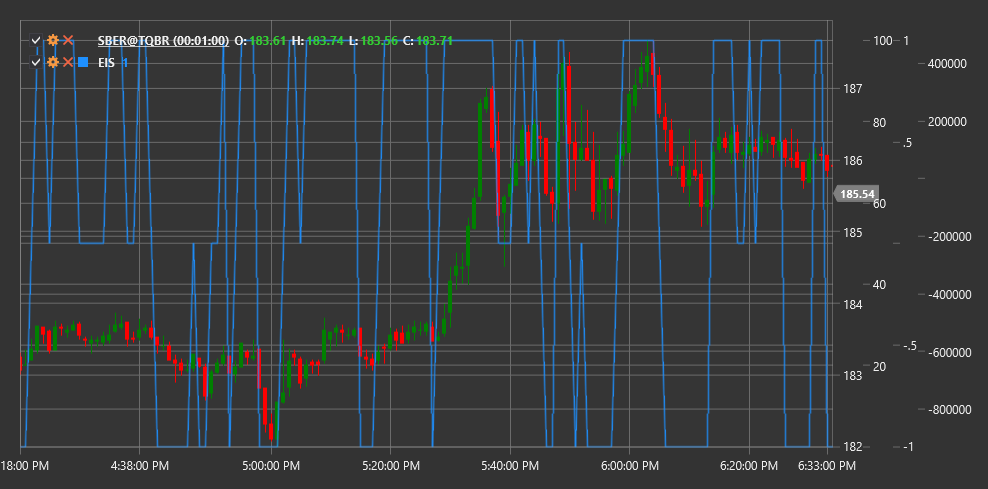

# EIS

**Sistema de Impulso de Elder (EIS)** é um indicador técnico desenvolvido pelo Dr. Alexander Elder que combina um indicador de tendência e um oscilador de momentum para determinar a direção e a força do movimento do mercado.

Para usar o indicador, deve ser usada a classe [ElderImpulseSystem](xref:StockSharp.Algo.Indicators.ElderImpulseSystem).

## Descrição

O Sistema de Impulso de Elder (EIS) é uma ferramenta simples mas poderosa para visualizar o momentum do mercado. Combina dois indicadores:
1. **Média móvel exponencial (EMA)** - para determinar a direção da tendência
2. **Histograma MACD** - para medir a força e o momentum do movimento do preço

O EIS classifica cada vela no gráfico de preços numa de três categorias (normalmente indicadas por cores diferentes):
- **Verde (forte impulso de alta)** - quando ambos os indicadores estão a subir
- **Vermelho (forte impulso de baixa)** - quando ambos os indicadores estão a descer
- **Azul ou neutro (sem impulso claro)** - quando os indicadores se movem em direções opostas

EIS é particularmente útil para:
- Determinar rapidamente de forma visual a direção e a força da tendência
- Identificar pontos de entrada e saída na direção da tendência principal
- Identificar potenciais pontos de reversão
- Filtrar sinais falsos

## Cálculo

O cálculo do Sistema de Impulso de Elder envolve os seguintes passos:

1. Calcular a média móvel exponencial de 13 períodos (EMA):
   ```
   EMA = EMA(Close, 13)
   ```

2. Calcular o histograma MACD (valores padrão: 12, 26, 9):
   ```
   Linha MACD = EMA(Close, 12) - EMA(Close, 26)
   Linha de sinal = EMA(Linha MACD, 9)
   Histograma MACD = Linha MACD - Linha de sinal
   ```

3. Determinar a classificação por cor para a vela atual:
   ```
   Se EMA[atual] > EMA[anterior] E Histograma MACD[atual] > Histograma MACD[anterior], então Verde (impulso de alta)
   Se EMA[atual] < EMA[anterior] E Histograma MACD[atual] < Histograma MACD[anterior], então Vermelho (impulso de baixa)
   Caso contrário Azul (sem impulso)
   ```

## Interpretação

O Sistema de Impulso de Elder é interpretado da seguinte forma:

1. **Velas verdes (forte impulso de alta)**:
   - Indicam forte momentum ascendente
   - Melhor momento para comprar ou manter posições longas
   - Uma série de velas verdes indica uma forte tendência ascendente

2. **Velas vermelhas (forte impulso de baixa)**:
   - Indicam forte momentum descendente
   - Melhor momento para vender ou manter posições curtas
   - Uma série de velas vermelhas indica uma forte tendência descendente

3. **Velas azuis (sem impulso claro)**:
   - Indicam incerteza ou consolidação
   - Sinalizam uma possível desaceleração ou reversão da tendência
   - Aparecem frequentemente durante períodos de consolidação ou antes de uma alteração de tendência

4. **Estratégias de trading**:
   - Comprar quando as velas mudam de azul para verde
   - Vender quando as velas mudam de azul para vermelho
   - Fechar posições longas quando as velas mudam de verde para qualquer outra cor
   - Fechar posições curtas quando as velas mudam de vermelho para qualquer outra cor

5. **Confirmação de tendência**:
   - Uma sequência de velas verdes confirma uma tendência ascendente
   - Uma sequência de velas vermelhas confirma uma tendência descendente
   - A alternância de cores indica uma tendência lateral ou incerteza



## Ver também

[EMA](ema.md)
[MACD](macd.md)
[Histograma MACD](macd_histogram.md)
[FI](force_index.md)
