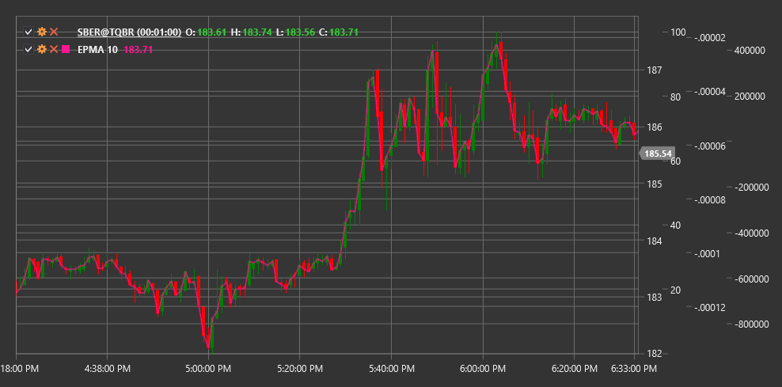

# EPMA

**Média móvel de ponto final (EPMA)** é um indicador técnico que é uma modificação da média móvel padrão, concebido para reduzir o atraso na identificação da tendência.

Para utilizar o indicador, é necessário usar a classe [EndpointMovingAverage](xref:StockSharp.Algo.Indicators.EndpointMovingAverage).

## Descrição

A média móvel de ponto final (EPMA) é uma forma especial de média móvel que se concentra nos pontos finais dos dados. Ao contrário das médias móveis padrão, que ponderam uniformemente todos os pontos num determinado período, a EPMA atribui mais peso aos pontos finais, permitindo uma resposta mais rápida às alterações da tendência.

O principal objetivo da EPMA é reduzir o atraso inerente às médias móveis tradicionais, mantendo a capacidade de filtrar o ruído do mercado. Devido à sua metodologia de cálculo, a EPMA reage frequentemente mais depressa às alterações de direção do preço, tornando-se uma ferramenta valiosa para traders que procuram identificar inversões de tendência mais cedo.

A EPMA é particularmente útil para:
- Identificação mais precoce de alterações de tendência
- Reduzir o atraso dos sinais
- Criar sistemas de negociação mais sensíveis
- Confirmar sinais de outros indicadores com menor atraso

## Parâmetros

O indicador tem os seguintes parâmetros:
- **Length** - período de cálculo (valor predefinido: 14)

## Cálculo

O cálculo da média móvel de ponto final baseia-se no método de regressão linear, concentrando-se nos pontos finais do período considerado:

1. Determinar a tendência linear entre os pontos inicial e final do período:
   ```
   valor inicial = Price[current - Length + 1]
   valor final = Price[current]
   ```

2. Calcular a inclinação da linha de tendência:
   ```
   Slope = (valor final - valor inicial) / (Length - 1)
   ```

3. Calcular a EPMA como uma projeção da linha de tendência para o ponto atual:
   ```
   EPMA = valor inicial + Slope * (Length - 1)
   ```

Na prática, a EPMA é igual ao último valor de preço (valor final) no período considerado, mas conceptualmente é uma projeção da tendência linear definida pelos pontos finais.

## Interpretação

A média móvel de ponto final é interpretada de forma semelhante a outras médias móveis, mas considerando a sua maior sensibilidade:

1. **Direção da EPMA**:
   - Uma EPMA ascendente indica uma tendência de alta
   - Uma EPMA descendente indica uma tendência de baixa

2. **Cruzamentos com o Preço**:
   - Quando o preço cruza a EPMA de baixo para cima, pode ser visto como um sinal de alta
   - Quando o preço cruza a EPMA de cima para baixo, pode ser visto como um sinal de baixa

3. **Cruzamentos de Múltiplas EPMA**:
   - O cruzamento de uma EPMA curta com uma EPMA longa de baixo para cima pode indicar o início de uma tendência de alta
   - O cruzamento de uma EPMA curta com uma EPMA longa de cima para baixo pode indicar o início de uma tendência de baixa

4. **Divergência com Outras Médias Móveis**:
   - Devido à sua maior sensibilidade, a EPMA pode reagir a alterações de tendência mais cedo do que as médias móveis tradicionais
   - A divergência entre a EPMA e outros tipos de médias móveis pode servir como aviso antecipado de uma potencial alteração de tendência

5. **Filtragem de Sinais**:
   - Devido à sua maior sensibilidade, a EPMA pode gerar mais sinais falsos durante períodos de consolidação lateral
   - Recomenda-se usar filtros adicionais ou confirmações de outros indicadores para melhorar a fiabilidade dos sinais



## Ver Também

[SMA](sma.md)
[EMA](ema.md)
[ZLEMA](zero_lag_exponential_moving_average.md)
[DEMA](dema.md)
