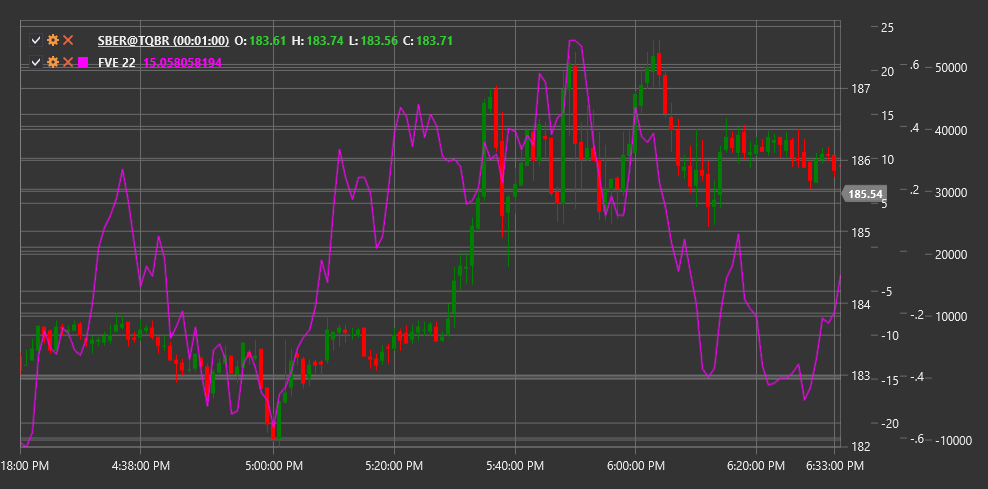

# FVE

**elemento de volume finito (FVE)** é um indicador técnico desenvolvido para analisar a relação entre preço e volume, ajudando a avaliar a pressão de compradores e vendedores no mercado.

Para utilizar o indicador, é necessário usar a classe [FiniteVolumeElement](xref:StockSharp.Algo.Indicators.FiniteVolumeElement).

## Descrição

O elemento de volume finito (FVE) analisa a relação entre alterações de preço e volumes de negociação para determinar a força potencial do movimento do preço. Baseia-se no pressuposto de que as alterações de preço são mais significativas quando confirmadas por volumes correspondentes.

O indicador FVE converte a alteração de preço, ponderada pelo volume, num oscilador que ajuda a determinar o equilíbrio relativo entre compradores e vendedores no mercado. Valores positivos do FVE indicam predominância dos compradores, enquanto valores negativos indicam predominância dos vendedores.

O FVE é particularmente útil para:
- Avaliar a força e sustentabilidade da tendência atual
- Identificar potenciais pontos de inversão
- Determinar divergências entre preço e volume
- Confirmar sinais de outros indicadores

## Parâmetros

O indicador tem os seguintes parâmetros:
- **Length** - período de suavização (valor predefinido: 22)

## Cálculo

O cálculo do indicador FVE envolve vários passos:

1. Calcular o preço típico para os períodos atual e anterior:
   ```
   Preço típico = (High + Low + Close) / 3
   ```

2. Calcular a alteração do preço típico:
   ```
   Alteração de preço = preço típico[current] - preço típico[previous]
   ```

3. Calcular a alteração de preço ponderada pelo volume:
   ```
   Alteração de preço ponderada por volume = alteração de preço * Volume[current]
   ```

4. Normalizar para considerar a escala do mercado:
   ```
   Valor normalizado = alteração de preço ponderada por volume / (volume médio durante o período * volatilidade do preço)
   ```

5. Soma acumulada e suavização:
   ```
   FVE = SMA(soma acumulada de valores normalizados, Length)
   ```

Onde:
- High, Low, Close - preços máximo, mínimo e de fecho
- Volume - volume de negociação
- SMA - média móvel simples
- Length - período de suavização

## Interpretação

O indicador FVE pode ser interpretado da seguinte forma:

1. **Cruzamentos da Linha Zero**:
   - A transição de valores negativos para positivos indica aumento da pressão compradora e pode ser vista como um sinal de alta
   - A transição de valores positivos para negativos indica aumento da pressão vendedora e pode ser vista como um sinal de baixa

2. **Valores Extremos**:
   - Valores positivos elevados (acima de +3) podem indicar condições de sobrecompra no mercado
   - Valores negativos elevados (abaixo de -3) podem indicar condições de sobrevenda no mercado

3. **Divergências**:
   - Divergência de alta (o preço forma um novo mínimo, enquanto o FVE forma um mínimo mais alto) pode sinalizar uma potencial inversão ascendente
   - Divergência de baixa (o preço forma um novo máximo, enquanto o FVE forma um máximo mais baixo) pode sinalizar uma potencial inversão descendente

4. **Confirmação da Tendência**:
   - Valores do FVE consistentemente positivos confirmam a força de uma tendência de alta
   - Valores do FVE consistentemente negativos confirmam a força de uma tendência de baixa

5. **Taxa de Alteração do FVE**:
   - Um aumento ou diminuição rápida dos valores do FVE pode indicar forte momentum do movimento do preço
   - A desaceleração das alterações nos valores do FVE pode sinalizar uma potencial desaceleração do momentum

6. **Níveis de Suporte e Resistência**:
   - Pontos históricos de inversão no gráfico do FVE podem servir como referências para futuras inversões



## Ver Também

[OBV](on_balance_volume.md)
[ADL](accumulation_distribution_line.md)
[ForceIndex](force_index.md)
[ChaikinMoneyFlow](chaikin_money_flow.md)

