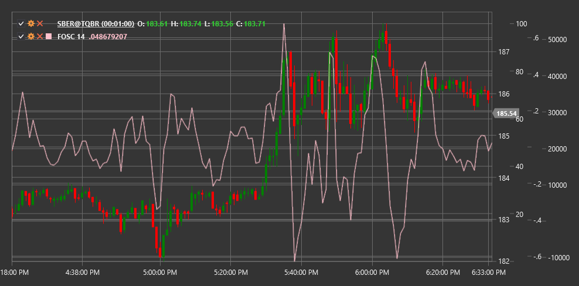

# FOSC

**Oscilador de previsão (FOSC)** é um indicador técnico que mede o desvio do preço em relação ao seu valor previsto obtido por regressão linear, representando esse desvio como uma percentagem.

Para utilizar o indicador, é necessário usar a classe [ForecastOscillator](xref:StockSharp.Algo.Indicators.ForecastOscillator).

## Descrição

O Oscilador de previsão (FOSC) baseia-se em regressão linear e foi concebido para medir o grau de desvio do preço atual em relação ao seu valor previsto. Ajuda os traders a avaliar quão próximo o preço atual está da tendência esperada ou quanto se desvia dela.

O indicador calcula uma linha de tendência usando regressão linear ao longo de um período especificado e depois compara o preço de fecho real com o valor previsto nessa linha. A diferença é expressa em percentagem, tornando o FOSC um oscilador que flutua em torno da linha zero.

O Oscilador de previsão é particularmente útil para:
- Determinar o grau de alinhamento do preço com a tendência esperada
- Identificar potenciais pontos de inversão
- Detetar desvios extremos do preço em relação à tendência
- Identificar períodos em que o preço se move mais depressa ou mais devagar do que o esperado

## Parâmetros

O indicador tem os seguintes parâmetros:
- **Length** - período para o cálculo da regressão linear (valor predefinido: 14)

## Cálculo

O cálculo do Oscilador de previsão envolve os seguintes passos:

1. Calcular a linha de previsão usando regressão linear ao longo do período especificado:
   ```
   Forecast = Linear Regression Line(Close, Length)
   ```

2. Calcular o oscilador como rácio percentual entre o preço atual e o valor previsto:
   ```
   FOSC = ((Close - Forecast) / Forecast) * 100
   ```

Onde:
- Close - preço de fecho atual
- Forecast - valor previsto obtido por regressão linear
- Length - período para o cálculo da regressão linear

## Interpretação

O Oscilador de previsão é interpretado da seguinte forma:

1. **Desvio em Relação a Zero**:
   - Valores positivos (FOSC > 0) indicam que o preço atual está acima do valor previsto, o que pode sugerir um movimento ascendente mais forte do que o esperado
   - Valores negativos (FOSC < 0) indicam que o preço atual está abaixo do valor previsto, o que pode sugerir um movimento descendente mais forte do que o esperado

2. **Valores Extremos**:
   - Valores positivos muito elevados podem indicar condições de sobrecompra relativamente à tendência
   - Valores negativos muito baixos podem indicar condições de sobrevenda relativamente à tendência

3. **Retorno a Zero**:
   - O movimento do FOSC de valores extremos em direção a zero pode sinalizar um potencial retorno do preço à sua linha de tendência

4. **Cruzamentos da Linha Zero**:
   - O cruzamento da linha zero de baixo para cima pode ser visto como um sinal de alta
   - O cruzamento da linha zero de cima para baixo pode ser visto como um sinal de baixa

5. **Divergências**:
   - Divergência de alta (o preço forma um novo mínimo, enquanto o FOSC forma um mínimo mais alto) pode indicar uma potencial inversão ascendente
   - Divergência de baixa (o preço forma um novo máximo, enquanto o FOSC forma um máximo mais baixo) pode indicar uma potencial inversão descendente

6. **Confirmação da Tendência**:
   - Se o FOSC se move na mesma direção que o preço, confirma a força da tendência atual
   - Se o FOSC se move na direção oposta ao preço, pode indicar enfraquecimento da tendência atual



## Ver Também

[LinearRegression](lrc.md)
[StandardError](standard_error.md)
[DisparityIndex](disparity_index.md)

