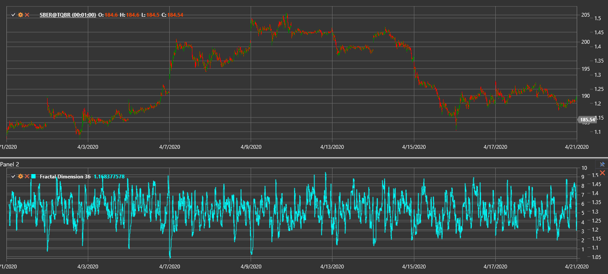

# FDI

**índice de dimensão fractal (FDI)** quantifica a irregularidade de uma série de preços.

Para utilizar o indicador, é necessário usar a classe [FractalDimension](xref:StockSharp.Algo.Indicators.FractalDimension).

## Descrição

O FDI varia de 1 a 2 e reflete o comportamento do mercado:
- Valores próximos de 1 indicam uma tendência persistente (trajetória mais suave).
- Valores em torno de 1,5 correspondem a um passeio aleatório.
- Valores próximos de 2 indicam um mercado lateral ou ruidoso.

O indicador baseia-se em geometria fractal e mede quão complexo é o percurso do preço.

## Parâmetros

O indicador tem o seguinte parâmetro:
- **Length** - período de cálculo (valor predefinido: 30)

## Cálculo

O FDI é calculado comparando o comprimento total do percurso do preço com o intervalo máximo-mínimo global:

1. Somar as diferenças absolutas entre preços consecutivos ao longo do período para obter o comprimento do percurso do preço.
2. Encontrar a diferença entre o máximo mais alto e o mínimo mais baixo do período.
3. Calcular o FDI usando:
   ```
   FDI = 1 + (log(PathLength) - log(Range)) / log(2 * (Length - 1))
   ```
4. Limitar o resultado entre 1 e 2.

## Interpretação

- **FDI próximo de 1** - forte comportamento tendencial.
- **FDI em torno de 1,5** - passeio aleatório; a força da tendência é neutra.
- **FDI mais próximo de 2** - mercado instável ou lateral.



## Ver Também

[Expoente de Hurst](hurst_exponent.md)

[Média móvel adaptativa fractal](fractal_adaptive_moving_average.md)
