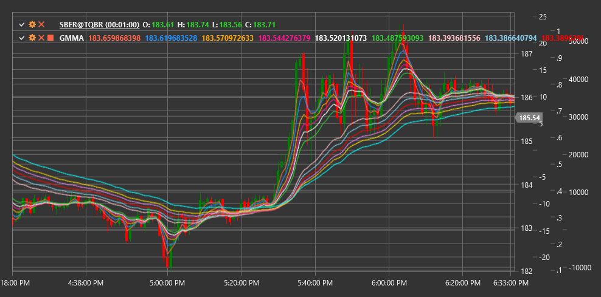

# GMMA

**Média móvel múltipla de Guppy (GMMA)** é um indicador técnico desenvolvido por Daryl Guppy que usa dois grupos de médias móveis exponenciais (EMA) para revelar a interação entre traders de curto prazo e investidores de longo prazo.

Para utilizar o indicador, é necessário usar a classe [GuppyMultipleMovingAverage](xref:StockSharp.Algo.Indicators.GuppyMultipleMovingAverage).

## Descrição

A média móvel múltipla de Guppy (GMMA) consiste em dois grupos de médias móveis exponenciais (EMA):
1. **Grupo de curto prazo** (normalmente 3, 5, 8, 10, 12 e 15 períodos) - representa a atividade dos traders de curto prazo
2. **Grupo de longo prazo** (normalmente 30, 35, 40, 45, 50 e 60 períodos) - representa a atividade dos investidores de longo prazo

A GMMA permite visualizar a interação entre estes dois grupos de participantes no mercado e determinar se o mercado está em tendência ou em consolidação. O indicador também ajuda a identificar momentos em que os traders de curto prazo começam a seguir a mesma direção dos investidores de longo prazo, o que frequentemente indica a formação ou o reforço de uma tendência.

A GMMA é particularmente útil para:
- Determinar a força e direção da tendência atual
- Identificar potenciais inversões de tendência
- Reconhecer quando o mercado transita de consolidação para tendência
- Determinar pontos de entrada ideais numa tendência existente

## Cálculo

O cálculo da GMMA envolve o cálculo de dois grupos de médias móveis exponenciais:

1. Grupo de EMA de curto prazo:
   ```
   EMA_3 = EMA(Price, 3)
   EMA_5 = EMA(Price, 5)
   EMA_8 = EMA(Price, 8)
   EMA_10 = EMA(Price, 10)
   EMA_12 = EMA(Price, 12)
   EMA_15 = EMA(Price, 15)
   ```

2. Grupo de EMA de longo prazo:
   ```
   EMA_30 = EMA(Price, 30)
   EMA_35 = EMA(Price, 35)
   EMA_40 = EMA(Price, 40)
   EMA_45 = EMA(Price, 45)
   EMA_50 = EMA(Price, 50)
   EMA_60 = EMA(Price, 60)
   ```

Onde:
- EMA - média móvel exponencial
- Price - preço (normalmente preço de fecho)

## Interpretação

A interpretação da GMMA envolve analisar ambos os grupos individuais e a sua interação:

1. **Posicionamento dos Grupos**:
   - Quando o grupo de curto prazo está acima do grupo de longo prazo, indica uma tendência de alta
   - Quando o grupo de curto prazo está abaixo do grupo de longo prazo, indica uma tendência de baixa

2. **Distância Entre Grupos**:
   - Uma grande distância entre grupos indica uma tendência forte
   - Uma pequena distância ou cruzamento dos grupos indica uma tendência fraca ou consolidação

3. **Compressão e Expansão**:
   - A compressão (convergência) das linhas dentro de um grupo indica incerteza e possível consolidação
   - A expansão (divergência) das linhas dentro de um grupo indica fortalecimento da tendência

4. **Cruzamentos**:
   - Cruzamento do grupo de curto prazo através do grupo de longo prazo de baixo para cima - forte sinal de alta
   - Cruzamento do grupo de curto prazo através do grupo de longo prazo de cima para baixo - forte sinal de baixa

5. **Alterações de Direção**:
   - Quando o grupo de longo prazo começa a mudar de direção, indica uma alteração significativa no sentimento dos investidores de longo prazo
   - Uma inversão do grupo de curto prazo sem alterações no grupo de longo prazo indica frequentemente uma correção temporária

6. **Pontos de Entrada Ideais**:
   - Após uma forte expansão, pode ocorrer compressão, indicando uma correção dentro da tendência
   - O fim dessa compressão (nova expansão) pode ser um bom ponto de entrada na direção da tendência principal

7. **Aviso Antecipado de Inversão**:
   - As médias de curto prazo mudam primeiro de direção, depois começam a surgir alterações nas médias de longo prazo
   - O cruzamento entre grupos pode servir como confirmação de inversão da tendência



## Ver Também

[EMA](ema.md)
[MovingAverageRibbon](moving_average_ribbon.md)
[RainbowCharts](rainbow_charts.md)
[MACD](macd.md)
