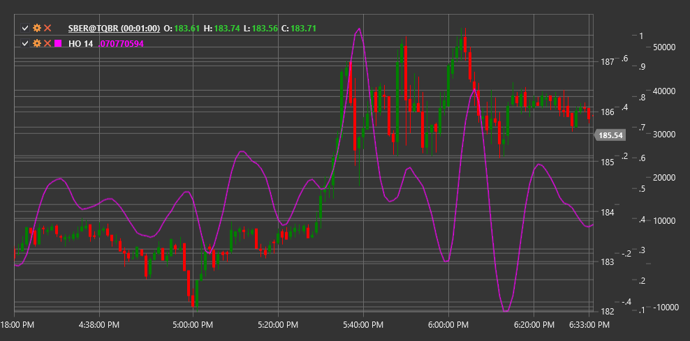

# HO

**oscilador harmônico (HO)** é um indicador técnico baseado na teoria da oscilação harmónica que ajuda a identificar componentes cíclicas no movimento do preço.

Para utilizar o indicador, é necessário usar a classe [HarmonicOscillator](xref:StockSharp.Algo.Indicators.HarmonicOscillator).

## Descrição

O oscilador harmônico (HO) é um indicador desenvolvido para identificar a periodicidade e a natureza cíclica dos movimentos de preço do mercado. Baseia-se no princípio de que muitos movimentos de preço contêm componentes harmónicas (periódicas) que podem ser isoladas e usadas para prever movimentos futuros do preço.

O indicador aplica métodos de análise espectral para decompor a série de preços em componentes harmónicas, destacando os ciclos dominantes. Em seguida, apresenta estas componentes cíclicas como um oscilador que ajuda os traders a determinar quando o preço pode atingir máximos ou mínimos locais dentro dos ciclos identificados.

O HO é particularmente útil para:
- Determinar a natureza cíclica do mercado
- Identificar potenciais pontos de inversão
- Filtrar o ruído do mercado
- Prever momentos em que o preço pode mudar de direção

## Parâmetros

O indicador tem os seguintes parâmetros:
- **Length** - período de análise (valor predefinido: 30)

## Cálculo

O cálculo do oscilador harmônico envolve os seguintes passos:

1. Pré-processamento da série de preços (remoção da tendência):
   ```
   Preço sem tendência = Price - SMA(Price, Length)
   ```

2. Aplicar análise espectral para identificar ciclos dominantes:
   ```
   Componentes espectrais = FFT(Preço sem tendência)
   ```

3. Extrair as componentes harmónicas mais significativas:
   ```
   Ciclos dominantes = extrair os N principais componentes espectrais com base na amplitude
   ```

4. Sintetizar o oscilador harmônico com base nos ciclos dominantes:
   ```
   HO = reconstrução dos ciclos dominantes por FFT inversa
   ```

Onde:
- Price - preço (normalmente preço de fecho)
- SMA - média móvel simples
- FFT - Transformada rápida de Fourier
- Length - período de análise

## Interpretação

O oscilador harmônico pode ser interpretado da seguinte forma:

1. **Cruzamentos da Linha Zero**:
   - Quando o HO cruza a linha zero de baixo para cima, pode ser visto como um sinal de alta
   - Quando o HO cruza a linha zero de cima para baixo, pode ser visto como um sinal de baixa

2. **Extremos do Oscilador**:
   - Quando o HO atinge um máximo local, pode indicar um potencial topo do preço
   - Quando o HO atinge um mínimo local, pode indicar um potencial fundo do preço

3. **Divergências**:
   - Divergência de alta: o preço forma um novo mínimo, enquanto o HO forma um mínimo mais alto
   - Divergência de baixa: o preço forma um novo máximo, enquanto o HO forma um máximo mais baixo

4. **Projeção de Ciclos**:
   - Picos e fundos regulares do HO podem ser usados para projetar futuros pontos de inversão
   - Analisar a duração entre picos/fundos pode ajudar a determinar o comprimento do ciclo dominante

5. **Alterações de Amplitude**:
   - O aumento da amplitude de oscilação do HO pode indicar fortalecimento da componente cíclica
   - A diminuição da amplitude de oscilação do HO pode indicar atenuação da componente cíclica

6. **Combinação com Outros Indicadores**:
   - O HO funciona melhor em combinação com indicadores de tendência
   - Em mercados tendenciais, os sinais do HO podem ser usados para determinar pontos de entrada na direção da tendência



## Ver Também

[SineWave](sine_wave.md)
[CenterOfGravityOscillator](center_of_gravity_oscillator.md)
[FisherTransform](ehlers_fisher_transform.md)
[DetrendedSyntheticPrice](detrended_synthetic_price.md)
