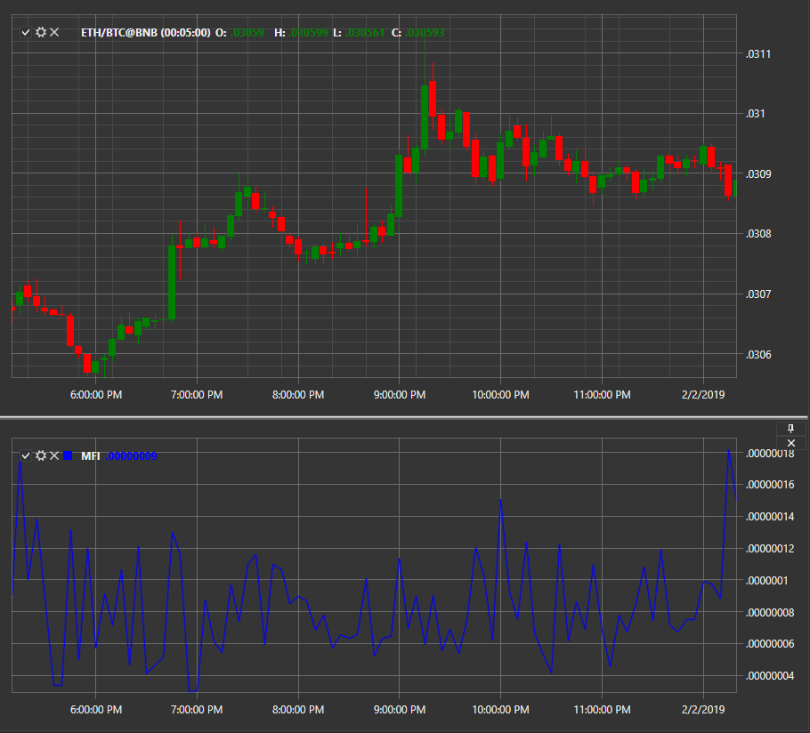

# Índice de facilitação do mercado

**Índice de facilitação do mercado (MFI)** é um indicador que avalia a prontidão do mercado para mover o preço. Analisa o rácio entre alterações de preço e alterações de volume durante um determinado período de tempo para medir a resposta do mercado às alterações de volume. Calcula o MFI usando a fórmula (High — Low) / Volume, proporcionando uma compreensão da dinâmica do mercado.
Os valores absolutos do indicador não podem fornecer sinais de negociação, ao contrário da sua dinâmica relativamente à dinâmica do volume.

Para utilizar o indicador, deve ser usada a classe [MarketFacilitationIndex](xref:StockSharp.Algo.Indicators.MarketFacilitationIndex).

## Ver Também

[Desvio médio](mean_deviation.md)

