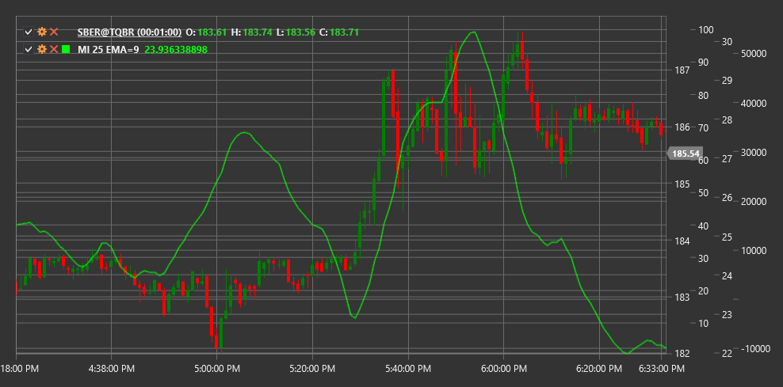

# MI

**Mass Index (MI)** é um indicador técnico desenvolvido por Donald Dorsey que identifica potenciais inversões de tendência analisando a expansão e contracção do intervalo de preços.

Para utilizar o indicador, é necessário usar a classe [MassIndex](xref:StockSharp.Algo.Indicators.MassIndex).

## Descrição

O Mass Index (MI) é uma ferramenta de análise técnica que ajuda a detectar potenciais inversões de tendência acompanhando alterações no intervalo de preços (diferença entre preços máximo e mínimo). O indicador foi desenvolvido por Donald Dorsey com base no pressuposto de que as inversões de tendência são normalmente antecedidas por expansão e subsequente contracção do intervalo de preços.

O MI mede a volatilidade usando médias móveis exponenciais (EMA) do intervalo de preços. Não prevê a direcção da inversão, apenas a sua probabilidade. É por isso que o MI é frequentemente usado em conjunto com outros indicadores direccionais.

O conceito principal é que, quando o mass index atinge um determinado limiar e depois cai abaixo desse nível, aumenta a probabilidade de inversão da tendência actual.

## Parâmetros

O indicador tem os seguintes parâmetros:
- **Length** - período principal de cálculo (valor predefinido: 25)
- **EmaLength** - período da EMA do intervalo de preços (valor predefinido: 9)

## Cálculo

O cálculo do Mass Index envolve os seguintes passos:

1. Calcular o intervalo High-Low para cada período:
   ```
   Range = High - Low
   ```

2. Calcular a EMA de 9 períodos do intervalo:
   ```
   EMA1 = EMA(Range, EmaLength)
   ```

3. Calcular a EMA de 9 períodos da EMA do intervalo:
   ```
   EMA2 = EMA(EMA1, EmaLength)
   ```

4. Calcular o rácio:
   ```
   Ratio = EMA1 / EMA2
   ```

5. Somar os rácios ao longo de 25 períodos:
   ```
   MI = Sum(Ratio durante os últimos períodos Length)
   ```

Onde:
- High - preço máximo do período
- Low - preço mínimo do período
- EMA - média móvel exponencial
- Length - período de soma (normalmente 25)
- EmaLength - período da EMA (normalmente 9)

## Interpretação

O Mass Index é interpretado da seguinte forma:

1. **"Reversal Hump"**:
   - O sinal clássico "reversal hump" forma-se quando o mass index sobe acima de 27 e depois cai abaixo de 26,5
   - Este padrão indica uma possível inversão de tendência, embora não preveja a sua direcção

2. **Níveis do Índice**:
   - Valores acima de 27 indicam expansão do intervalo de preços e aumento da volatilidade
   - Valores altos seguidos por uma queda podem anteceder uma inversão de tendência
   - Valores baixos (abaixo de 20) indicam contracção do intervalo de preços e redução da volatilidade

3. **Direcção da Tendência**:
   - O mass index não indica a direcção da tendência nem a sua inversão
   - São necessários indicadores adicionais ou métodos de análise para determinar a direcção (por exemplo, médias móveis ou níveis de suporte/resistência)

4. **Divergências**:
   - Divergências entre o preço e o mass index são menos significativas do que o padrão "reversal hump"
   - No entanto, discrepâncias entre novos máximos/mínimos do preço e máximos/mínimos descendentes do mass index podem indicar enfraquecimento da tendência

5. **Combinação com Outros Indicadores**:
   - O Mass index funciona melhor quando combinado com indicadores da direcção da tendência
   - Combinações populares incluem EMA, MACD ou RSI para determinar a potencial direcção da inversão

6. **Alterações de Volatilidade**:
   - Um aumento acentuado do mass index indica expansão significativa do intervalo de preços, que pode anteceder um movimento forte
   - Uma queda gradual do índice sugere estreitamento do intervalo e possível consolidação

7. **Ajuste de Parâmetros**:
   - Parâmetros padrão (9 para EMA, 25 para soma) funcionam bem na maioria dos períodos
   - Reduzir períodos pode criar sinais mais rápidos, mas pode aumentar sinais falsos



## Ver Também

[ATR](atr.md)
[BollingerBands](bollinger_bands.md)
[ChoppinessIndex](choppiness_index.md)
[TrueRange](true_range.md)
