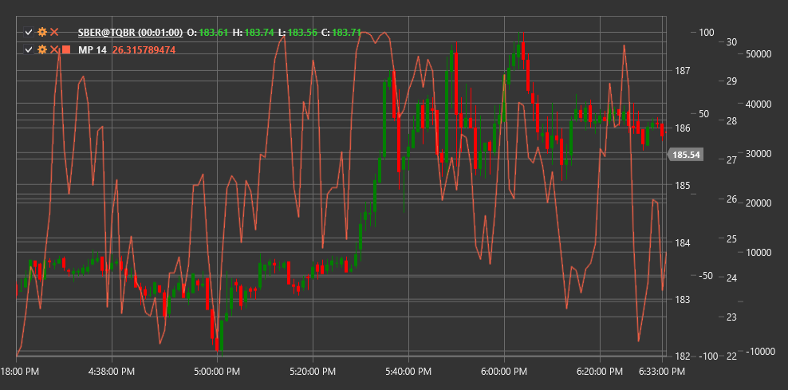

# MP

**Momentum Pinball (MP)** é um indicador técnico que analisa o momentum do preço e as suas alterações para identificar potenciais pontos de reversão e a força da tendência no mercado.

Para usar o indicador, é necessário usar a classe [MomentumPinball](xref:StockSharp.Algo.Indicators.MomentumPinball).

## Descrição

O indicador Momentum Pinball (MP) é um oscilador especializado concebido para acompanhar o momentum do preço e identificar potenciais pontos de reversão. O nome "pinball" reflete a capacidade do indicador para identificar momentos em que o preço, como uma bola numa máquina de pinball, ressalta de posições extremas.

O MP analisa a relação entre o momentum atual e os seus extremos históricos, determinando quando o mercado atinge condições de sobrecompra ou sobrevenda. O indicador também ajuda a identificar momentos em que o momentum começa a enfraquecer, o que pode anteceder uma reversão de tendência.

A ideia principal é que valores extremos de momentum são frequentemente instáveis e, depois de atingir esses extremos, costuma seguir-se uma correção ou reversão. O MP ajuda a visualizar este processo ao acompanhar tanto o próprio momentum como as suas alterações.

## Parâmetros

O indicador tem os seguintes parâmetros:
- **Length** - período de cálculo (valor predefinido: 14)

## Cálculo

O cálculo do indicador Momentum Pinball envolve os seguintes passos:

1. Calcular o momentum base como a diferença entre o preço atual e o preço de há N períodos:
   ```
   Momentum = Price[current] - Price[current - Length]
   ```

2. Determinar o máximo e o mínimo históricos do momentum no período especificado:
   ```
   Max_Momentum = Maximum(Momentum) durante o período Length
   Min_Momentum = Minimum(Momentum) durante o período Length
   ```

3. Normalizar o momentum atual relativamente aos extremos históricos:
   ```
   Normalized_Momentum = (Momentum - Min_Momentum) / (Max_Momentum - Min_Momentum)
   ```

4. Calcular a taxa de variação do momentum normalizado:
   ```
   Momentum_Change = Normalized_Momentum[current] - Normalized_Momentum[current - 1]
   ```

5. Cálculo final do MP como uma combinação do momentum normalizado e da sua alteração:
   ```
   MP = Normalized_Momentum + Momentum_Change
   ```

Onde:
- Price - preço (normalmente o preço de fecho)
- Length - período de cálculo
- Momentum - momentum base
- Normalized_Momentum - momentum normalizado
- Momentum_Change - alteração do momentum

## Interpretação

O indicador Momentum Pinball pode ser interpretado da seguinte forma:

1. **Níveis extremos**:
   - Valores acima de 0,8 indicam condições de sobrecompra no mercado
   - Valores abaixo de 0,2 indicam condições de sobrevenda no mercado
   - Quando o MP atinge estes níveis, aumenta a probabilidade de uma reversão ou correção

2. **Divergências**:
   - Divergência altista: o preço forma um novo mínimo, enquanto o MP forma um mínimo mais alto
   - Divergência baixista: o preço forma um novo máximo, enquanto o MP forma um máximo mais baixo
   - As divergências antecedem frequentemente reversões significativas de tendência

3. **Cruzamentos da linha central**:
   - O cruzamento do MP do nível 0,5 de baixo para cima pode ser visto como um sinal altista
   - O cruzamento do MP do nível 0,5 de cima para baixo pode ser visto como um sinal baixista

4. **Ressaltos dos extremos**:
   - A reversão do MP a partir de níveis de sobrecompra ou sobrevenda pode gerar sinais de entrada no mercado
   - Sinais particularmente fortes formam-se quando essas reversões são acompanhadas por divergências

5. **Análise da tendência**:
   - Valores sustentados do MP acima de 0,5 confirmam uma tendência ascendente
   - Valores sustentados do MP abaixo de 0,5 confirmam uma tendência descendente
   - Oscilações do MP em torno do nível 0,5 indicam uma tendência lateral ou incerteza

6. **Força do momentum**:
   - Uma inclinação acentuada do MP indica momentum forte
   - Uma inclinação suave do MP indica momentum fraco
   - A desaceleração da subida ou descida do MP pode anteceder uma reversão de tendência

7. **Combinação com outros indicadores**:
   - O MP é frequentemente usado em conjunto com indicadores de tendência
   - Por exemplo, médias móveis podem ser usadas para determinar a direção da tendência, enquanto o MP pode ser usado para pontos de entrada e saída



## Ver também

[Momentum](momentum.md)
[RSI](rsi.md)
[StochasticOscillator](stochastic_oscillator.md)
[PrettyGoodOscillator](pretty_good_oscillator.md)

