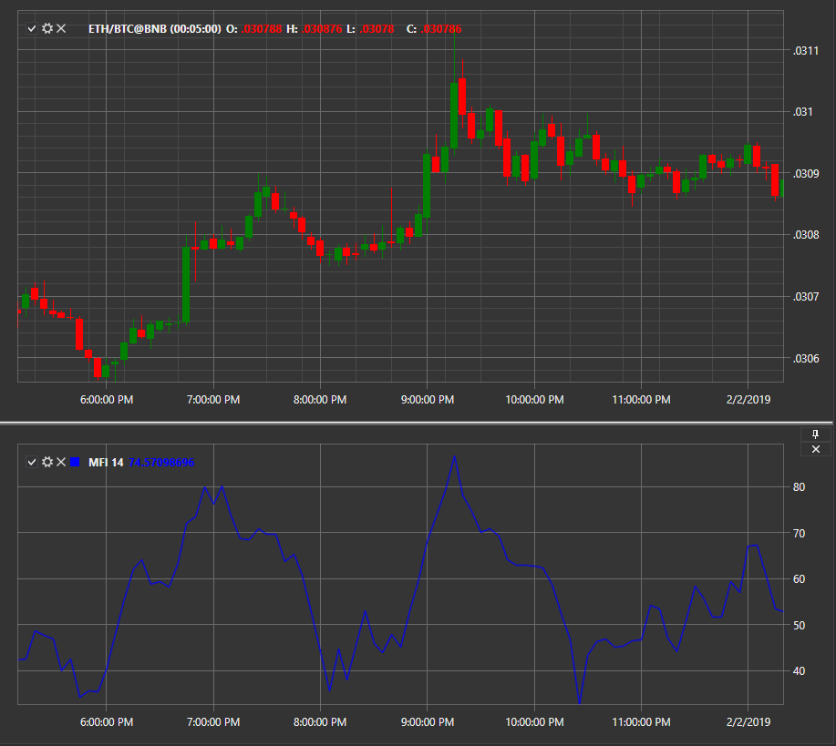

# Money Flow Index

**Money Flow Index (MFI)** calcula a diferença entre fluxos monetários de entrada e saída. Se o valor base do ativo estiver abaixo da diferença, isso indica um aumento da massa monetária de entrada, ou seja, o mercado é bullish. Se for observado o contrário, significa que os investidores estão a abandonar o instrumento e o mercado é bearish.  
O indicador é um oscilador técnico para determinar condições de sobrecompra ou sobrevenda num ativo. Também pode ser usado para identificar divergências que alertam para uma alteração da tendência no preço. O oscilador move-se entre 0 e 100.

Para usar o indicador, deve ser usada a classe [MoneyFlowIndex](xref:StockSharp.Algo.Indicators.MoneyFlowIndex).

## Ver também

[MACD](macd.md)

