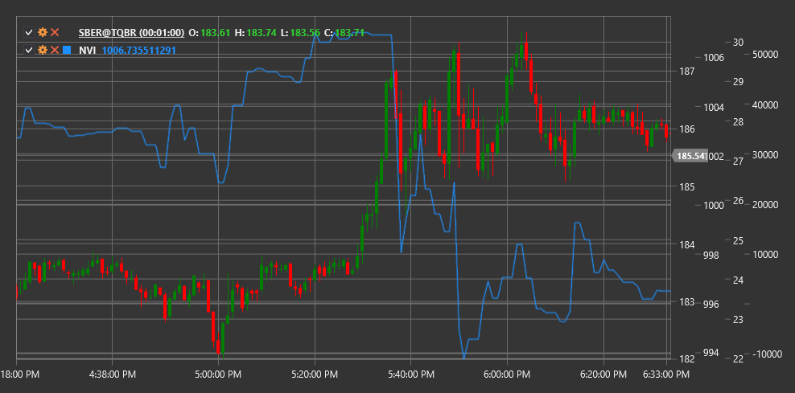

# NVI

**Negative Volume Index (NVI)** é um indicador técnico desenvolvido por Paul Dysart que se foca nas alterações de preço nos dias em que o volume de negociação diminui em comparação com o dia anterior.

Para usar o indicador, é necessário usar a classe [NegativeVolumeIndex](xref:StockSharp.Algo.Indicators.NegativeVolumeIndex).

## Descrição

O Negative Volume Index (NVI) baseia-se na ideia de que o "smart money" está ativo em dias de baixo volume, enquanto a "multidão" (traders não profissionais) está mais ativa em dias de volume elevado. O NVI só se altera nos dias em que o volume atual é inferior ao volume do dia anterior.

O conceito do indicador sugere que os movimentos de preço com volume reduzido são mais significativos e refletem frequentemente as ações de investidores informados. O NVI procura acompanhar estes movimentos, ignorando alterações de preço em dias com volume aumentado.

O NVI é frequentemente usado em conjunto com o Positive Volume Index (PVI) complementar, que, pelo contrário, considera apenas os dias em que o volume aumenta.

## Cálculo

O cálculo do Negative Volume Index envolve os seguintes passos:

1. Definir o valor inicial do NVI (normalmente 1000):
   ```
   NVI[initial] = 1000
   ```

2. Para cada período subsequente:
   ```
   If Volume[current] < Volume[previous], then:
       NVI[current] = NVI[previous] * (1 + (Price[current] - Price[previous]) / Price[previous])
   Otherwise:
       NVI[current] = NVI[previous]
   ```

Onde:
- Price - preço (normalmente o preço de fecho)
- Volume - volume de negociação

Por outras palavras, o NVI só muda nos dias em que o volume de negociação diminui e permanece inalterado nos dias com volume crescente ou inalterado.

## Interpretação

O Negative Volume Index pode ser interpretado da seguinte forma:

1. **Análise da tendência**:
   - NVI em subida indica que o "smart money" está a comprar, o que pode antecipar uma futura subida do preço
   - NVI em queda indica que o "smart money" está a vender, o que pode antecipar uma futura descida do preço

2. **Cruzamentos de médias móveis**:
   - O NVI é frequentemente comparado com a sua média móvel de 255 dias (aproximadamente um ano de negociação)
   - Quando o NVI está acima da sua SMA de 255 dias, é considerado um sinal bullish
   - Quando o NVI está abaixo da sua SMA de 255 dias, é considerado um sinal bearish

3. **Divergências**:
   - Divergência bullish: o preço forma um novo mínimo, enquanto o NVI forma um mínimo mais alto
   - Divergência bearish: o preço forma um novo máximo, enquanto o NVI forma um máximo mais baixo

4. **Combinação com PVI**:
   - Quando tanto o NVI como o PVI estão a subir, é um forte sinal bullish
   - Quando tanto o NVI como o PVI estão a cair, é um forte sinal bearish
   - Quando o NVI sobe e o PVI cai, pode indicar que o "smart money" compra enquanto a "multidão" vende (cenário potencialmente bullish)
   - Quando o NVI cai e o PVI sobe, pode indicar que o "smart money" vende enquanto a "multidão" compra (cenário potencialmente bearish)

5. **Alterações de longo prazo**:
   - O NVI é frequentemente visto como um indicador de longo prazo
   - Uma alteração sustentada na direção do NVI pode sinalizar uma mudança significativa no sentimento de mercado

6. **Confirmação de outros indicadores**:
   - O NVI funciona melhor quando combinado com outros indicadores técnicos e métodos de análise
   - Os sinais do NVI tornam-se mais fiáveis quando confirmados por outros indicadores

7. **Definição de limiares**:
   - Alguns traders definem níveis de limiar para o NVI (por exemplo, 5% acima ou abaixo da média móvel)
   - O cruzamento destes limiares pode ser considerado um sinal mais forte do que cruzamentos simples



## Ver também

[OBV](on_balance_volume.md)
[ADL](accumulation_distribution_line.md)
[ChaikinMoneyFlow](chaikin_money_flow.md)
[ForceIndex](force_index.md)

