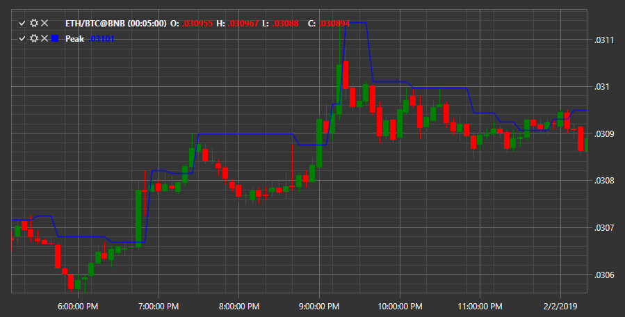

# Peak

O indicador **Peak** mostra o valor de pico para o período. 

Para usar o indicador, deve usar a classe [Peak](xref:StockSharp.Algo.Indicators.Peak). 

## Conteúdo recomendado

[QStick](qstick.md)

