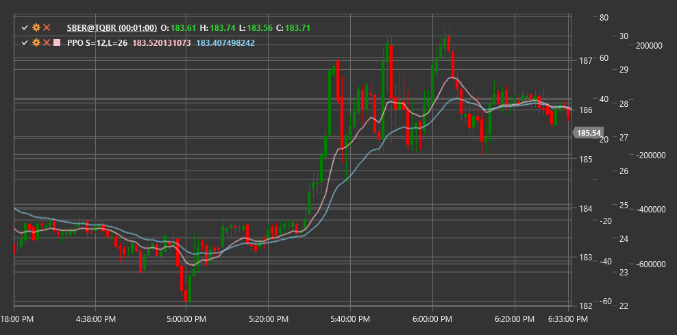

# PPO

**Percentage Price Oscillator (PPO)** é um indicador técnico semelhante ao MACD, mas expressa a diferença entre duas médias móveis exponenciais como percentagem, em vez de valores absolutos.

Para usar o indicador, é necessário usar a classe [PercentagePriceOscillator](xref:StockSharp.Algo.Indicators.PercentagePriceOscillator).

## Descrição

O Percentage Price Oscillator (PPO) é uma variação do indicador mais conhecido MACD (Moving Average Convergence Divergence). A principal diferença é que o PPO expressa a diferença entre duas médias móveis exponenciais como percentagem, em vez de unidades absolutas. Isto torna o PPO particularmente útil ao comparar instrumentos diferentes com níveis de preço distintos ou ao analisar um único instrumento durante um período longo em que o seu preço mudou significativamente.

O PPO consiste em três componentes:
1. **Linha PPO** - diferença entre a EMA rápida e a lenta, expressa como percentagem
2. **Linha de sinal** - EMA da linha PPO
3. **Histograma** - diferença entre a linha PPO e a linha de sinal

O indicador PPO oscila em torno da linha zero, onde valores positivos indicam um sentimento de mercado bullish e valores negativos indicam um sentimento bearish. A magnitude do desvio em relação a zero reflete a força da tendência atual.

## Parâmetros

O indicador tem os seguintes parâmetros:
- **ShortPeriod** - período para calcular a EMA curta (valor predefinido: 12)
- **LongPeriod** - período para calcular a EMA longa (valor predefinido: 26)

## Cálculo

O cálculo do Percentage Price Oscillator envolve os seguintes passos:

1. Calcular as médias móveis exponenciais curta e longa:
   ```
   Short EMA = EMA(Price, ShortPeriod)
   Long EMA = EMA(Price, LongPeriod)
   ```

2. Calcular a linha PPO como a diferença percentual entre a EMA curta e a EMA longa:
   ```
   PPO Line = ((Short EMA - Long EMA) / Long EMA) * 100
   ```

3. Calcular a linha de sinal (normalmente EMA de 9 períodos da linha PPO):
   ```
   Signal Line = EMA(PPO Line, 9)
   ```

4. Calcular o histograma:
   ```
   Histogram = PPO Line - Signal Line
   ```

Onde:
- Price - preço (normalmente o preço de fecho)
- EMA - média móvel exponencial
- ShortPeriod - período da EMA curta
- LongPeriod - período da EMA longa

## Interpretação

O Percentage Price Oscillator pode ser interpretado da seguinte forma:

1. **Cruzamentos da linha zero**:
   - O cruzamento da linha PPO da linha zero de baixo para cima pode ser visto como um sinal bullish
   - O cruzamento da linha PPO da linha zero de cima para baixo pode ser visto como um sinal bearish

2. **Cruzamentos da linha de sinal**:
   - O cruzamento da linha PPO da linha de sinal de baixo para cima pode ser visto como um sinal bullish
   - O cruzamento da linha PPO da linha de sinal de cima para baixo pode ser visto como um sinal bearish

3. **Divergências**:
   - Divergência bullish: o preço forma um novo mínimo, enquanto o PPO forma um mínimo mais alto
   - Divergência bearish: o preço forma um novo máximo, enquanto o PPO forma um máximo mais baixo

4. **Sobrecompra/Sobrevenda**:
   - Valores positivos extremamente elevados do PPO podem indicar condições de sobrecompra no mercado
   - Valores negativos extremamente baixos do PPO podem indicar condições de sobrevenda no mercado

5. **Análise do histograma**:
   - A expansão do histograma indica reforço da tendência atual
   - A contração do histograma indica enfraquecimento da tendência atual
   - A alteração da cor (ou sinal) do histograma indica uma alteração no momentum de curto prazo

6. **Comparação de instrumentos**:
   - Ao contrário do MACD, o PPO pode ser usado para comparação direta de diferentes instrumentos
   - Valores de PPO mais elevados para um instrumento em comparação com outro podem indicar momentum relativo mais forte

7. **Filtragem de sinais**:
   - Os sinais de cruzamento da linha de sinal são mais fiáveis quando o PPO está alinhado com a tendência principal
   - Por exemplo, sinais bullish são mais fiáveis quando o PPO é positivo, e sinais bearish são mais fiáveis quando o PPO é negativo



## Ver também

[MACD](macd.md)
[EMA](ema.md)
[Percentage Price Oscillator Signal](percentage_price_oscillator_signal.md)
[Percentage Price Oscillator Histogram](percentage_price_oscillator_histogram.md)
[PercentageVolumeOscillator](percentage_volume_oscillator.md)
[TRIX](trix.md)

