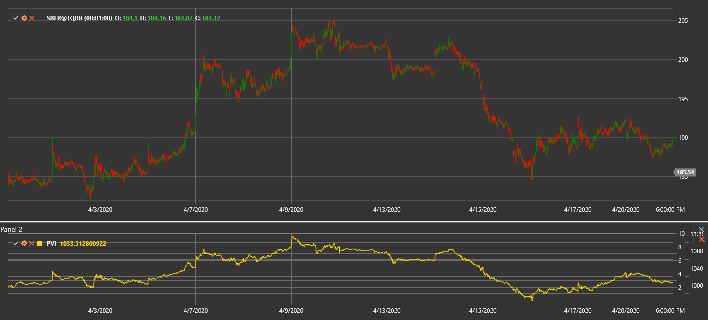

# PVI

**índice de volume positivo (PVI)** é um indicador técnico desenvolvido por Paul Dysart que se foca nas alterações de preço nos dias em que o volume de negociação aumenta em comparação com o dia anterior.

Para usar o indicador, é necessário usar a classe [PositiveVolumeIndex](xref:StockSharp.Algo.Indicators.PositiveVolumeIndex).

## Descrição

O índice de volume positivo (PVI) baseia-se na ideia de que a "multidão" (traders não profissionais) está mais ativa em dias de volume elevado, enquanto o "smart money" atua em dias de baixo volume. O PVI só se altera nos dias em que o volume atual é superior ao volume do dia anterior.

O indicador sugere que os movimentos de preço com volume aumentado são significativos e refletem frequentemente o sentimento do mercado em massa. O PVI acompanha estes movimentos, ignorando alterações de preço nos dias com volume mais baixo.

O PVI é frequentemente usado em conjunto com o índice de volume negativo (NVI) complementar, que, pelo contrário, considera apenas os dias em que o volume diminui.

## Cálculo

O cálculo do índice de volume positivo envolve os seguintes passos:

1. Definir o valor inicial do PVI (normalmente 1000):
   ```
   PVI[initial] = 1000
   ```

2. Para cada período subsequente:
   ```
   Se Volume[current] > Volume[previous], então:
       PVI[current] = PVI[previous] * (1 + (Price[current] - Price[previous]) / Price[previous])
   Otherwise:
       PVI[current] = PVI[previous]
   ```

Onde:
- Price - preço (normalmente o preço de fecho)
- Volume - volume de negociação

Por outras palavras, o PVI só muda nos dias em que o volume de negociação aumenta e permanece inalterado nos dias com volume decrescente ou inalterado.

## Interpretação

O índice de volume positivo pode ser interpretado da seguinte forma:

1. **Análise da tendência**:
   - PVI em subida indica que a "multidão" está a comprar, o que pode antecipar uma futura subida do preço
   - PVI em queda indica que a "multidão" está a vender, o que pode antecipar uma futura descida do preço

2. **Cruzamentos de médias móveis**:
   - O PVI é frequentemente comparado com a sua média móvel de 255 dias (aproximadamente um ano de negociação)
   - Quando o PVI está acima da sua SMA de 255 dias, é considerado um sinal altista
   - Quando o PVI está abaixo da sua SMA de 255 dias, é considerado um sinal baixista

3. **Divergências**:
   - Divergência altista: o preço forma um novo mínimo, enquanto o PVI forma um mínimo mais alto
   - Divergência baixista: o preço forma um novo máximo, enquanto o PVI forma um máximo mais baixo

4. **Combinação com NVI**:
   - Quando tanto o PVI como o NVI estão a subir, é um forte sinal altista
   - Quando tanto o PVI como o NVI estão a cair, é um forte sinal baixista
   - Quando o PVI sobe e o NVI cai, pode indicar que a "multidão" compra enquanto o "smart money" vende (cenário potencialmente altista)
   - Quando o PVI cai e o NVI sobe, pode indicar que a "multidão" vende enquanto o "smart money" compra (cenário potencialmente baixista)

5. **Alterações de longo prazo**:
   - O PVI é frequentemente visto como um indicador de longo prazo
   - Uma alteração sustentada na direção do PVI pode sinalizar uma mudança significativa no sentimento de mercado

6. **Confirmação de outros indicadores**:
   - O PVI funciona melhor quando combinado com outros indicadores técnicos e métodos de análise
   - Os sinais do PVI tornam-se mais fiáveis quando confirmados por outros indicadores

7. **Definição de limiares**:
   - Alguns traders definem níveis de limiar para o PVI (por exemplo, 5% acima ou abaixo da média móvel)
   - O cruzamento destes limiares pode ser considerado um sinal mais forte do que cruzamentos simples



## Ver também

[OBV](on_balance_volume.md)
[ADL](accumulation_distribution_line.md)
[ChaikinMoneyFlow](chaikin_money_flow.md)
[ForceIndex](force_index.md)
[NegativeVolumeIndex](negative_volume_index.md)

