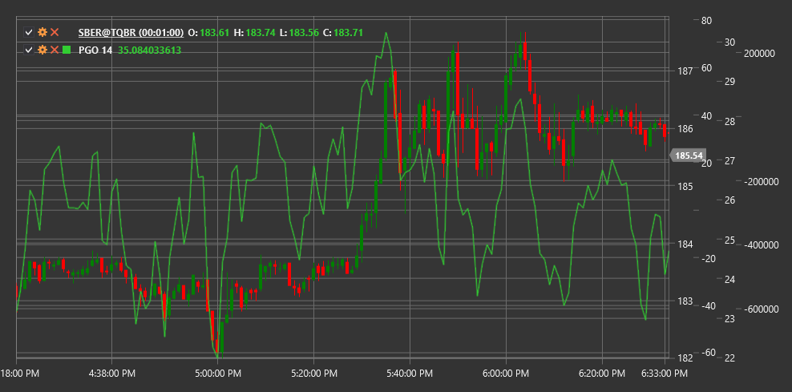

# PGO

**oscilador bastante bom (PGO)** é um indicador técnico desenvolvido por Mark Johnson que compara o preço de fecho atual com preços anteriores, considerando a volatilidade, para determinar condições de sobrecompra ou sobrevenda no mercado.

Para usar o indicador, é necessário usar a classe [PrettyGoodOscillator](xref:StockSharp.Algo.Indicators.PrettyGoodOscillator).

## Descrição

O oscilador bastante bom (PGO) é um indicador que avalia a força do preço de fecho atual relativamente aos seus valores históricos durante um período específico. O PGO tem em conta não só a posição do preço atual no intervalo histórico, mas também a volatilidade desse intervalo, tornando-o mais adaptativo a condições de mercado em mudança.

O nome "oscilador bastante bom" reflete a abordagem pragmática do seu criador - o indicador não pretende ser uma ferramenta perfeita, mas oferece uma forma "pretty good" de avaliar a situação atual do mercado.

O PGO é particularmente útil para identificar condições de sobrecompra e sobrevenda, bem como para detetar divergências que podem anteceder reversões de tendência.

## Parâmetros

O indicador tem os seguintes parâmetros:
- **Length** - período de cálculo (valor predefinido: 14)

## Cálculo

O cálculo do oscilador bastante bom envolve os seguintes passos:

1. Determinar o máximo mais alto (máxima mais alta) e o mínimo mais baixo (mínima mais baixa) durante o período especificado:
   ```
   máxima mais alta = Highest(High, Length)
   mínima mais baixa = Lowest(Low, Length)
   ```

2. Calcular o desvio padrão dos preços de fecho durante o período especificado:
   ```
   Desvio padrão = StdDev(Close, Length)
   ```

3. Calcular o oscilador bastante bom:
   ```
   PGO = (Close - (máxima mais alta + mínima mais baixa) / 2) / desvio padrão
   ```

Onde:
- Close - preço de fecho atual
- High - preço máximo
- Low - preço mínimo
- Length - período de cálculo
- StdDev - desvio padrão

## Interpretação

O oscilador bastante bom pode ser interpretado da seguinte forma:

1. **Níveis de sobrecompra e sobrevenda**:
   - Valores acima de +2 indicam frequentemente condições de sobrecompra no mercado
   - Valores abaixo de -2 indicam frequentemente condições de sobrevenda no mercado
   - Valores extremos (+3/-3 e acima/abaixo) podem sinalizar sobrecompra/sobrevenda significativa e potencial reversão

2. **Cruzamentos da linha zero**:
   - O cruzamento do PGO da linha zero de baixo para cima pode ser visto como um sinal altista
   - O cruzamento do PGO da linha zero de cima para baixo pode ser visto como um sinal baixista

3. **Divergências**:
   - Divergência altista: o preço forma um novo mínimo, enquanto o PGO forma um mínimo mais alto
   - Divergência baixista: o preço forma um novo máximo, enquanto o PGO forma um máximo mais baixo
   - As divergências antecedem frequentemente reversões significativas de tendência

4. **Confirmação da tendência**:
   - Valores positivos do PGO indicam que o preço está acima do intervalo médio, característico de uma tendência ascendente
   - Valores negativos do PGO indicam que o preço está abaixo do intervalo médio, característico de uma tendência descendente

5. **Avaliação da força da tendência**:
   - Quanto mais distante de zero estiver o valor do PGO, mais forte é a tendência atual
   - A convergência do PGO com a linha zero pode indicar enfraquecimento da tendência

6. **Filtragem de sinais**:
   - O PGO pode ser usado para filtrar sinais de outros indicadores
   - Por exemplo, considerar apenas sinais altista quando o PGO é positivo, e apenas sinais baixista quando o PGO é negativo

7. **Saídas de posição**:
   - Valores extremos do PGO podem ser usados como sinais para realizar lucros
   - Por exemplo, sair de posições longas quando o PGO excede +2, e de posições curtas quando o PGO cai abaixo de -2



## Ver também

[RSI](rsi.md)
[Oscilador estocástico](stochastic_oscillator.md)
[CCI](cci.md)
[StandardDeviation](standard_deviation.md)

