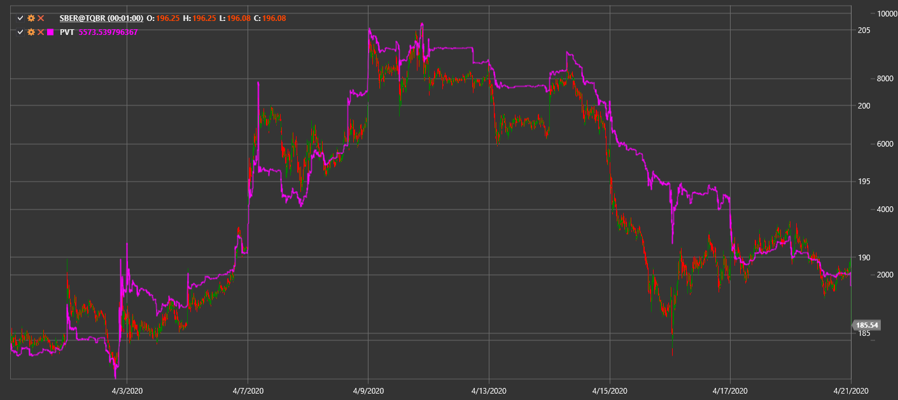

# PVT

**Tendência preço-volume (PVT)** é um indicador cumulativo que multiplica a alteração do preço pelo volume para mostrar pressão compradora ou vendedora.

Para usar o indicador, deve usar a classe [PriceVolumeTrend](xref:StockSharp.Algo.Indicators.PriceVolumeTrend).

## Conteúdo recomendado

[OBV](on_balance_volume.md)
