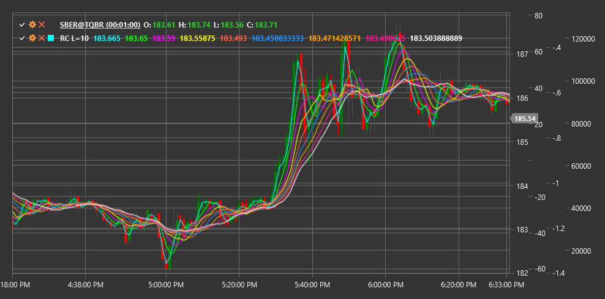

# RC

**gráficos arco-íris (RC)** é um indicador de análise técnica composto por um conjunto de médias móveis com períodos diferentes, apresentadas num único gráfico. Visualmente, o indicador assemelha-se a um arco-íris, daí o seu nome.

Para utilizar o indicador, é necessário usar a classe [RainbowCharts](xref:StockSharp.Algo.Indicators.RainbowCharts).

## Descrição

Os gráficos arco-íris baseiam-se na utilização de várias médias móveis (normalmente SMA simples) com períodos progressivamente crescentes. As diferentes linhas de média móvel são coloridas com cores diferentes, criando um efeito de arco-íris no gráfico.

O indicador ajuda a determinar a direção e a força da tendência:
- Quando as linhas divergem, isso indica fortalecimento da tendência
- Quando as linhas convergem, isso pode sinalizar enfraquecimento da tendência ou uma potencial inversão
- Quando o preço está acima de todas as linhas, indica uma forte tendência ascendente
- Quando o preço está abaixo de todas as linhas, indica uma forte tendência descendente

## Parâmetros

- **Lines** - número de médias móveis SMA utilizadas no gráfico rainbow.

## Cálculo

Os gráficos arco-íris consistem em várias médias móveis (SMA), em que o período de cada linha subsequente aumenta por um determinado passo. Para n linhas com um período base p, os períodos são calculados como:

```
Period(i) = p + i * step
```

Onde:
- i - número da linha (de 0 a n-1)
- step - passo de aumento do período (normalmente 1)



## Ver também

[SMA](sma.md)
