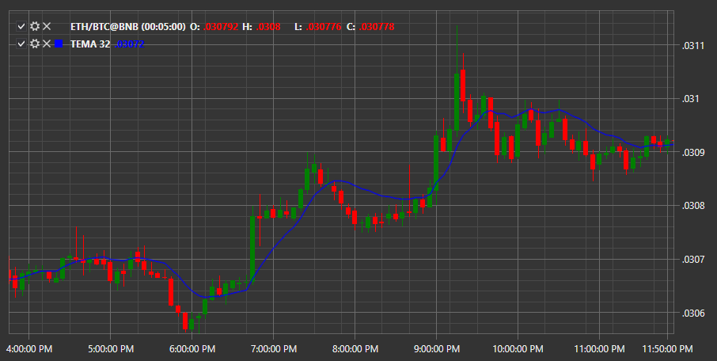

# TEMA

**Média móvel exponencial tripla (TEMA)** utiliza várias médias móveis exponenciais (EMA), em triplo, para eliminar atrasos na previsão de preços.

Para utilizar o indicador, deve usar a classe [TripleExponentialMovingAverage](xref:StockSharp.Algo.Indicators.TripleExponentialMovingAverage). 

## Conteúdo recomendado

[TRIX](trix.md)
