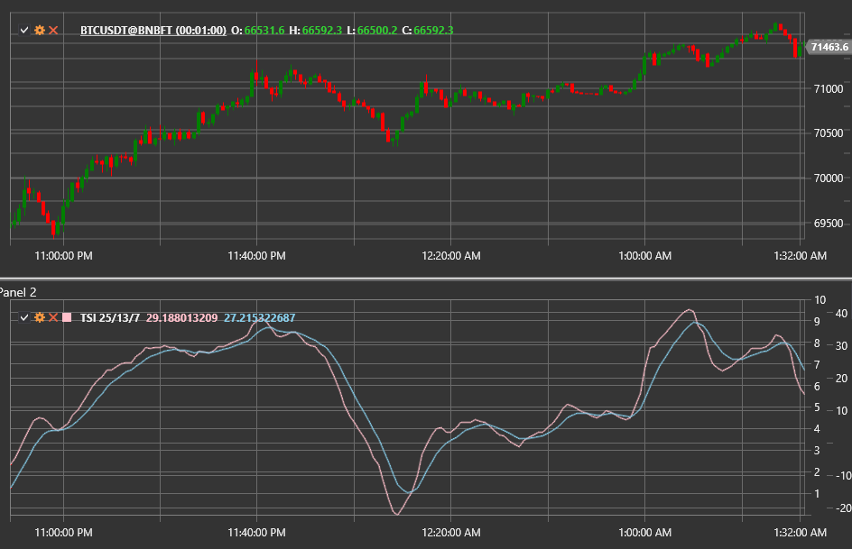

# índice de força verdadeira

O **índice de força verdadeira (TSI)** é um oscilador de momentum criado por William Blau. Aplica uma dupla suavização à diferença
entre preços de fecho consecutivos, ajudando a identificar tendências e pontos de inversão com menos atraso em comparação com muitos
osciladores clássicos.

Use a classe [TrueStrengthIndex](xref:StockSharp.Algo.Indicators.TrueStrengthIndex) para aceder ao indicador.

## Cálculo

1. Calcule a alteração de preço `m = Close − PreviousClose`.
2. Aplique duas médias móveis exponenciais com períodos `Length1` e `Length2` tanto a `m` como a `|m|`.
3. Calcule a razão entre o momentum com dupla suavização e o momentum absoluto com dupla suavização:
   `TSI = 100 × EMA(EMA(m, Length1), Length2) / EMA(EMA(|m|, Length1), Length2)`.
4. Opcionalmente, derive uma linha de sinal usando uma EMA do TSI com o período **Signal**.

## Parâmetros

- **Length1** — primeiro período de suavização.
- **Length2** — segundo período de suavização.
- **Signal** — período da linha de sinal (opcional).

## Interpretação

- **TSI > 0** — momentum altista.
- **TSI < 0** — momentum baixista.
- **Cruzamentos da linha de sinal** fornecem entradas de negociação.
- **Divergências** entre o TSI e o preço alertam para potenciais inversões.

Devido à dupla suavização e à normalização, o indicador filtra ruído, mantendo-se ainda assim reativo em comparação com cálculos
simples de momentum.

## Ver também

[Momentum](momentum.md)
[MACD](macd.md)
[RSI](rsi.md)
