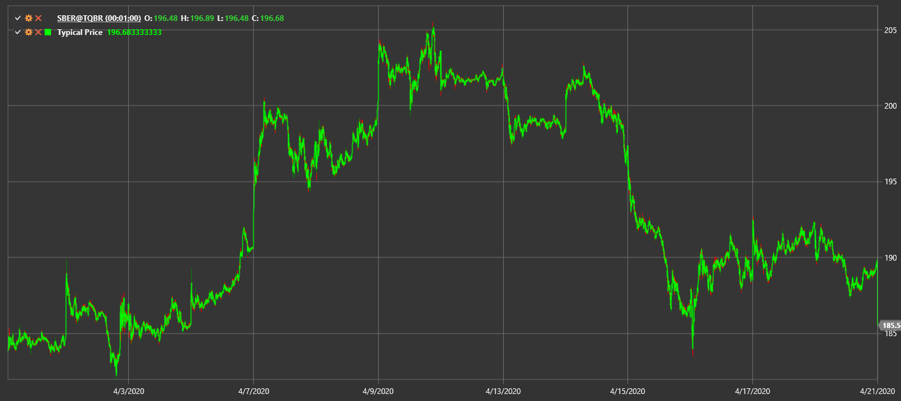

# Preço típico

**Preço típico** calcula a média dos valores máximo, mínimo e de fecho de uma vela.

Para usar o indicador, deve usar a classe [TypicalPrice](xref:StockSharp.Algo.Indicators.TypicalPrice).

## Conteúdo recomendado

[Preço mediano](median_price.md)
