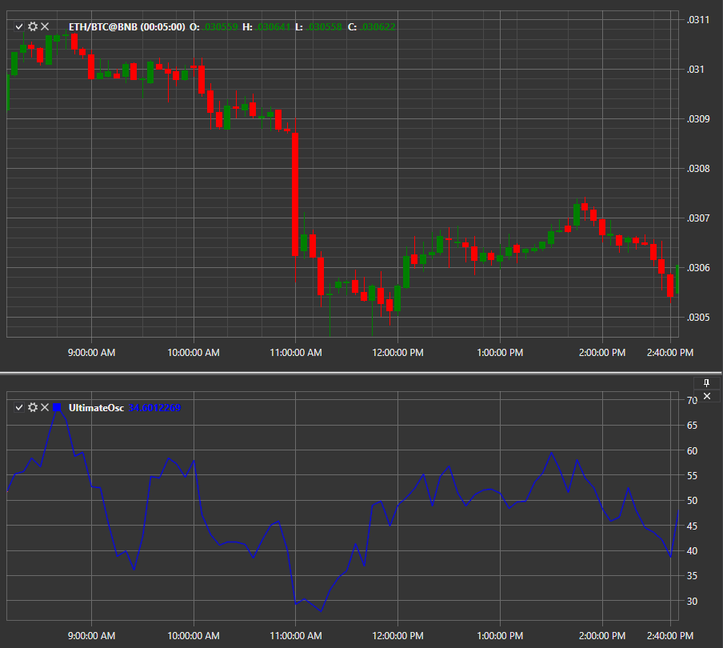

# UO

**oscilador definitivo (UO)** é um indicador técnico desenvolvido por Larry Williams em 1976 para medir o momentum em vários períodos temporais. Usando uma média ponderada para três períodos temporais diferentes, o indicador tem menos volatilidade e menos sinais de negociação em comparação com outros indicadores que dependem de um único período temporal.

Para usar o indicador, deve usar a classe [UltimateOscillator](xref:StockSharp.Algo.Indicators.UltimateOscillator).

## Conteúdo recomendado

[VHF](vhf.md)
