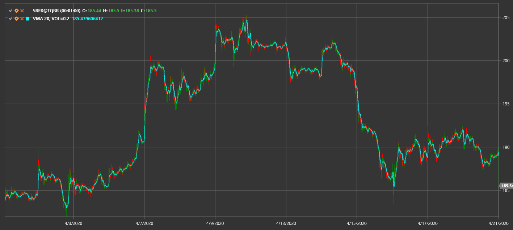

# média móvel variável

**Média móvel variável (VMA)** adapta o seu período de suavização com base na volatilidade do mercado.

Para usar o indicador, deve usar a classe [VariableMovingAverage](xref:StockSharp.Algo.Indicators.VariableMovingAverage).

## Conteúdo recomendado

[VIDYA](vidya.md)
