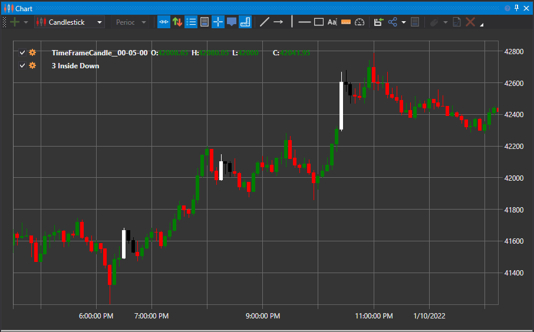

# Padrão 3 Inside Down e 3 Inside Up

Os termos 3 Inside Down e 3 Inside Up referem-se a um par de padrões de velas de reversão (cada um contendo três velas separadas), apresentados em gráficos de velas. O padrão requer a formação de três velas numa sequência específica, indicando que a tendência atual perdeu força e pode estar a começar a mover-se na direção oposta.

##### Características Principais:

- O padrão 3 Inside Up é um padrão de reversão bullish composto por uma vela descendente grande, uma vela ascendente mais pequena contida dentro da vela anterior, seguida de outra vela ascendente que fecha acima do fecho da segunda vela.
- O padrão 3 Inside Down é um padrão de reversão bearish composto por uma vela ascendente grande, uma vela descendente mais pequena contida dentro da vela anterior, seguida de outra vela descendente que fecha abaixo do fecho da segunda vela.
- Estes padrões são de curto prazo por natureza e nem sempre levam a uma alteração significativa, ou mesmo menor, da tendência.
- Considere utilizar estes padrões no contexto da tendência geral. Por exemplo, utilize 3 Inside Up durante um pullback numa tendência ascendente geral.

### 3 Inside Up

A versão ascendente do padrão é bullish, indicando que o movimento descendente do preço pode estar a terminar e que se inicia um movimento ascendente. Estas são as características do padrão:

1. O mercado está numa tendência descendente ou a mover-se para baixo.
2. A primeira vela é uma vela preta (descendente) com um corpo grande.
3. A segunda vela é uma vela branca (ascendente) com um corpo pequeno, que abre e fecha dentro do corpo da primeira vela.
4. A terceira vela é uma vela branca (ascendente), que fecha acima do fecho da segunda vela.

### 3 Inside Down

A versão descendente do padrão é bearish. Mostra que o movimento ascendente do preço está a terminar e que o preço começa a mover-se para baixo. Estas são as características do padrão:

1. O mercado está numa tendência ascendente ou a mover-se para cima.
2. A primeira vela é uma vela branca com um corpo grande.
3. A segunda vela é uma vela preta com um corpo pequeno, que abre e fecha dentro do corpo da primeira vela.
4. A terceira vela é uma vela preta, que fecha abaixo do fecho da segunda vela.

Estes padrões são essencialmente padrões harami seguidos por uma vela de confirmação, pela qual muitos traders aguardam no caso dos haramis.

## Ver Também

[Padrão 3 Outside Down e 3 Outside Up](3_outside_down_3_outside_up.md)
