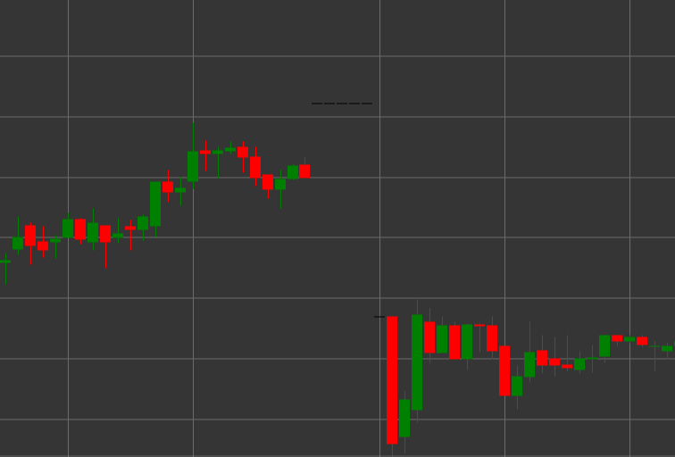

# Padrão Dragonfly

Dragonfly é um padrão de velas caracterizado por preços de abertura e fecho iguais, sem sombra superior e com uma sombra inferior longa. A vela assemelha-se à forma da letra "T", o que lhe deu o nome "dragonfly".

##### Características Principais:

- O preço de abertura é igual ao preço de fecho (O == C).
- Sem sombra superior (TS == 0).
- Sombra inferior longa.
- Semelhante a um Hammer, mas com corpo neutro (doji).

### Interpretação

Dragonfly Doji é considerado um potencial sinal de reversão, especialmente numa tendência descendente:

- A sombra inferior longa indica que os vendedores controlaram o mercado durante a maior parte do período, mas depois os compradores fizeram regressar o preço ao nível de abertura.
- A rejeição de preços mais baixos pode sinalizar o fim da pressão bearish.
- Ao contrário de um Hammer normal, a igualdade entre os preços de abertura e fecho (doji) indica um equilíbrio de forças mais pronunciado.
- Numa tendência descendente, este padrão tem implicações bullish e pode antecipar uma reversão.
- Numa tendência ascendente, pode sinalizar uma potencial correção.

### Estratégias de Negociação

Dragonfly requer confirmação adicional para tomar decisões de negociação:

- Aguardar por uma vela bullish de confirmação no período seguinte antes de entrar numa posição longa.
- Colocar um stop-loss abaixo do mínimo da Dragonfly.
- Utilizar em conjunto com níveis de suporte ou condições de sobrevenda em indicadores.
- Prestar atenção ao volume - volume elevado durante a formação de uma Dragonfly aumenta a credibilidade do sinal.
- Possível utilização para determinar um ponto de saída de posições curtas, mesmo sem entrar numa posição longa.

## Ver também

[Padrão Gravestone](gravestone.md)

[Padrão Hammer](hammer.md)
