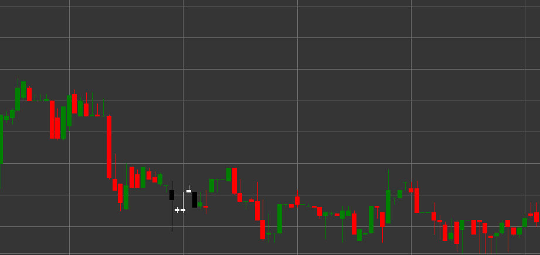

# Padrão Falling Three Methods

Falling Three Methods é um padrão de continuação de tendência bearish composto por cinco velas que se forma numa tendência descendente. Este padrão mostra uma consolidação ou pausa temporária dentro de uma tendência descendente existente antes da sua continuação.

##### Características Principais:

- A primeira vela é preta (bearish), com preço de abertura superior ao preço de fecho (O > C) e um corpo longo.
- As três velas seguintes são brancas (bullish), com preço de abertura inferior ao preço de fecho (O < C), com corpos pequenos: (B < pB * 0.5m), (B < ppB * 0.5m), (B < pppB * 0.5m).
- Os corpos das três velas intermédias não se estendem para além do intervalo da primeira vela.
- A quinta vela é preta (bearish), com preço de abertura superior ao preço de fecho (O > C) e um corpo longo (B > pB * 2).
- A quinta vela rompe o mínimo da primeira vela e fecha mais abaixo.
- Forma-se numa tendência descendente.

### Interpretação

Falling Three Methods é considerado um sinal fiável de continuação de tendência descendente:

- A primeira vela preta longa mostra a força da tendência descendente.
- Três velas brancas pequenas representam uma consolidação ou correção temporária, durante a qual os compradores não conseguiram alterar significativamente a tendência.
- A quinta vela preta longa confirma o regresso do controlo aos vendedores e a continuação da tendência descendente.
- Este padrão pode ser visto como uma bandeira ou pennant na análise técnica clássica.
- Essa sequência de velas indica que a correção foi utilizada para acumular posições curtas antes da continuação do movimento descendente.

### Estratégias de Negociação

Falling Three Methods proporciona boas oportunidades para entrar ou reforçar posições curtas:

- Entrar numa posição curta na abertura após a quinta vela ou quando o mínimo da primeira vela é rompido.
- Colocar um stop-loss acima do máximo das velas de correção ou acima do máximo da primeira vela.
- O lucro alvo pode ser definido utilizando uma projeção igual à distância desde o início da tendência até à primeira vela do padrão.
- Prestar atenção ao volume - idealmente, o volume diminui nas três velas intermédias e aumenta significativamente na quinta vela.
- Combinar com outros indicadores técnicos para confirmar o sinal.
- Considerar níveis de suporte importantes abaixo do preço atual que possam afetar o desenvolvimento do movimento.

## Ver também

[Padrão Rising Three Methods](rising_three_methods.md)

[Padrão Three Black Crows](three_black_crows.md)
