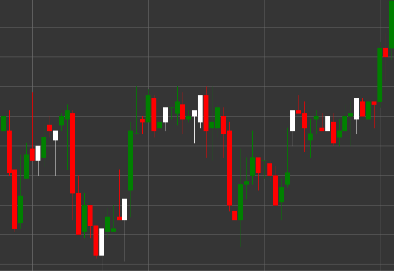

# Padrão Hammer

Hammer é um padrão de velas bullish que se forma durante uma tendência descendente. A vela tem um corpo pequeno na parte superior e uma sombra inferior longa, com a sombra superior ausente ou muito curta. O nome vem da semelhança da vela com um martelo.

##### Características Principais:

- O preço de abertura é inferior ao preço de fecho (O < C), embora possa ser o contrário.
- Corpo pequeno da vela na parte superior do intervalo de preços.
- Sombra inferior longa, normalmente 2-3 vezes mais longa do que o corpo.
- Sem sombra superior ou com uma sombra muito curta.
- Forma-se numa tendência descendente.

### Interpretação

Hammer é considerado um forte sinal de potencial reversão de uma tendência descendente:

- A sombra inferior longa mostra que o preço caiu significativamente durante o período, mas depois os compradores intervieram e empurraram o preço novamente para cima.
- Isto indica a rejeição do mercado a preços mais baixos e uma potencial mudança de sentimento de bearish para bullish.
- Quanto mais longa for a sombra inferior, mais forte é o potencial sinal de reversão.
- A cor do corpo da vela é menos importante, embora um hammer branco/verde seja considerado mais bullish do que um preto/vermelho.

### Estratégias de Negociação

Hammer proporciona oportunidades para entrar numa posição longa:

- Aguardar por confirmação da vela seguinte - uma vela bullish após um Hammer reforça o sinal de reversão.
- Colocar um nível de stop-loss abaixo do mínimo do Hammer.
- Definir um lucro alvo com base em níveis de resistência anteriores ou na relação risco/recompensa.
- Combinar com outros indicadores técnicos, como RSI ou MACD, para confirmar a reversão da tendência.
- Volume de negociação mais elevado durante a formação de um Hammer aumenta a fiabilidade do sinal.

## Ver também

[Padrão Inverted Hammer](inverted_hammer.md)

[Padrão Hanging Man](hanging_man.md)
