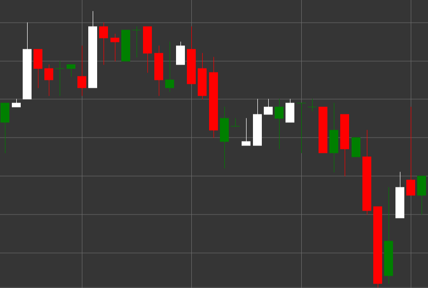

# Padrão Inverted Hammer

Inverted Hammer é um padrão de velas bullish que se forma durante uma tendência descendente. A vela tem um corpo pequeno na parte inferior e uma sombra superior longa, com a sombra inferior ausente ou muito curta. Parece um martelo invertido.

##### Características Principais:

- O preço de abertura é inferior ao preço de fecho (O < C), embora possa ser o contrário.
- Corpo pequeno da vela na parte inferior do intervalo de preços.
- Sombra superior longa, normalmente 2-3 vezes mais longa do que o corpo.
- Sem sombra inferior ou com uma sombra muito curta.
- Forma-se numa tendência descendente.

### Interpretação

Inverted Hammer é considerado um potencial sinal de reversão de uma tendência descendente:

- A sombra superior longa mostra que os compradores tentaram empurrar o preço significativamente para cima, mas não conseguiram mantê-lo em níveis elevados.
- Apesar da incapacidade de fechar nos máximos, o aparecimento de compradores após uma tendência descendente prolongada pode sinalizar uma mudança de sentimento.
- Este padrão não é tão forte como o Hammer clássico e requer confirmação de velas subsequentes.
- A cor do corpo é menos importante, embora um Inverted Hammer branco/verde seja considerado mais bullish.

### Estratégias de Negociação

Inverted Hammer requer uma abordagem cautelosa e confirmação:

- Aguardar obrigatoriamente por confirmação da vela seguinte - uma vela bullish forte após um Inverted Hammer aumenta significativamente a probabilidade de reversão.
- Colocar um nível de stop-loss abaixo do mínimo do Inverted Hammer.
- Utilizar um tamanho de posição menor em comparação com padrões de reversão mais fiáveis.
- Combinar com indicadores de sobrevenda como RSI ou Stochastic para aumentar a probabilidade de uma negociação bem-sucedida.
- Prestar atenção ao volume de negociação - volume elevado aumenta a importância do sinal.

## Ver também

[Padrão Hammer](hammer.md)

[Padrão Shooting Star](shooting_star.md)
