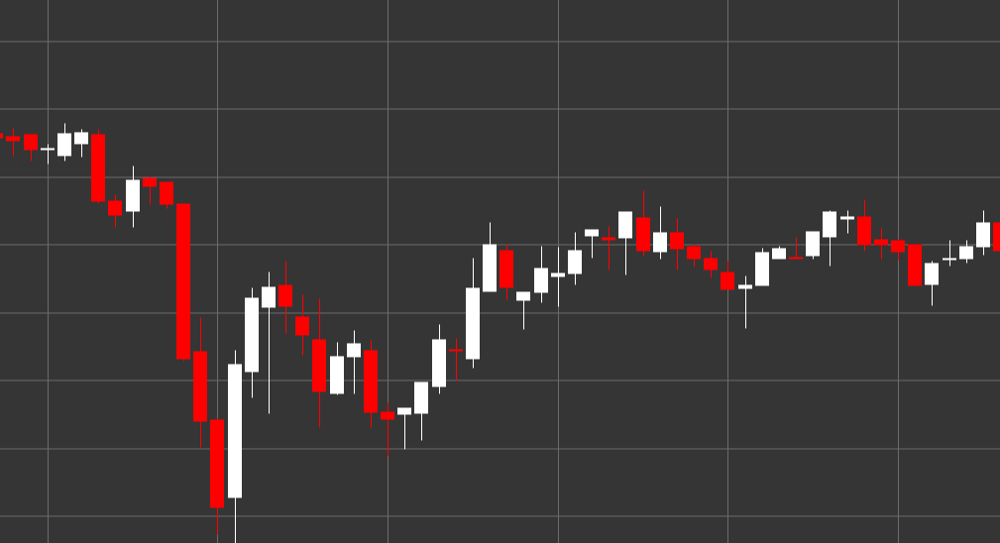

# Padrão Vela branca

Vela branca (vela altista) é um padrão clássico de velas que se forma quando o preço de fecho é superior ao preço de abertura. Esta vela reflete um sentimento altista do mercado, em que os compradores controlaram o preço durante o período de formação da vela.

##### Características principais:

- O preço de abertura é inferior ao preço de fecho (O < C).
- O corpo da vela é normalmente colorido a branco (ou verde nos gráficos modernos).
- Indica o predomínio dos compradores sobre os vendedores.
- O tamanho do corpo da vela mostra a força do movimento altista.

### Interpretação

Vela branca sinaliza pressão altista no mercado:

- Quanto maior for o corpo da vela, mais forte é a pressão altista.
- Uma vela branca longa após uma tendência descendente pode indicar uma possível reversão.
- A presença de sombras curtas indica que os compradores controlaram o preço ao longo de todo o período.
- Velas brancas consecutivas indicam uma tendência ascendente estável.

### Estratégias de Negociação

Embora uma única vela branca normalmente não seja um sinal de negociação independente, pode ser usada como parte de uma estratégia mais ampla:

- Confirmação de uma tendência ascendente ou de uma reversão após um movimento descendente.
- Procura de velas brancas longas em níveis de suporte para potenciais posições longas.
- Utilização em combinação com outros padrões de velas, por exemplo, uma vela branca após um engolfo altista.
- Identificação de níveis de resistência após uma série de velas brancas consecutivas.

## Ver também

[Padrão Vela preta](black_candle.md)

[Padrão Marubozu branco](white_marubozu.md)
