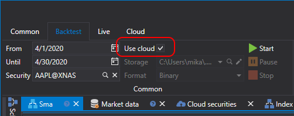

# Testes na nuvem

Para testar estratégias na nuvem, é necessário encontrar primeiro todos os instrumentos de interesse. Para isso, no **Designer**, abra o painel de pesquisa de instrumentos disponíveis para teste no separador **Cloud**:

Quando introduz o nome do instrumento no campo de pesquisa e clica em **Search** (ou prime **Enter**), o servidor StockSharp devolve resultados de pesquisa adequados. Os intervalos de datas dos dados históricos também serão indicados à direita dos nomes dos instrumentos.

Este procedimento só precisa de ser feito uma vez para cada novo instrumento. Depois disso, os instrumentos encontrados serão guardados localmente no disco e, ao reiniciar o **Designer**, já serão carregados a partir do armazenamento local. Este passo é necessário porque a especificação do instrumento é obrigatória ao iniciar a estratégia (bem como ao especificar instrumentos diretamente no bloco [Variável](../strategies/using_visual_designer/elements/data_sources/variable.md)).

Depois, deve voltar à estratégia e ativar a opção de nuvem no separador **Backtest**:

Ao iniciar o teste, a estratégia será enviada para a nuvem StockSharp em vez de ser testada localmente:

Após a conclusão do teste, o relatório com os resultados será apresentado no separador de espera de tarefas:

Se quiser ver o histórico dos testes na nuvem, bem como as tarefas ativas atuais, abra o painel **Tasks** no separador **Cloud**:

