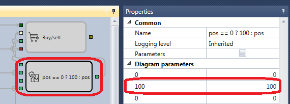

# Primeiros passos

Como exemplo, será considerada a estratégia SMA.

Para executar o teste no histórico, deve selecionar uma estratégia cujo esquema será testado no histórico. A estratégia é selecionada no painel [Schemas](../user_interface/schemas.md), na pasta da estratégia, fazendo duplo clique na estratégia pretendida.

Antes do teste, carregue os dados de mercado (instrumentos, candles, tick trades e\/ou livros de ordens). Isto é descrito em [Armazenamento de dados de mercado](../market_data_storage.md).

Ao mudar para o separador com uma estratégia, o separador **Emulação** abre automaticamente no **Faixa de opções**. Defina o período de teste neste separador. No campo de dados de mercado, especifique o armazenamento necessário ([Armazenamento de dados de mercado](../market_data_storage.md)); no campo de instrumento, especifique o instrumento necessário.

No exemplo com a estratégia SMA serão usados os seguintes parâmetros.

1. Instrumento AAPL@NASDAQ
2. Armazenamento padrão \\Documents\\StockSharp\\Designer\\Storage
3. Formato do armazenamento - CSV
4. Tipo de dados obtidos do armazenamento - Ticks
5. Livro de ordens - gerado
6. Profundidade do livro de ordens - 5
7. Tamanho do spread - 2
8. Candles com timeframe de 30 s
9. Volume - 100

É necessário configurar os parâmetros selecionados:

Depois de configurar todos os parâmetros necessários, inicie o teste da estratégia clicando no botão .

Durante ou após o teste, pode ver gráficos e tabelas com a informação do teste.

O gráfico mostra que as transações ocorrem no cruzamento das médias móveis, conforme previsto pela estratégia. Também se pode ver que as ordens são satisfeitas em várias transações. Isto acontece devido ao uso do livro de ordens gerado, que aumenta o realismo do teste. O facto de as ordens serem satisfeitas em várias transações pode ser visto nas tabelas Trades, em Statistics e no gráfico Positions.

No **gráfico Positions**, pode ver-se que a estratégia reduziu o volume operado. Isto aconteceu porque o livro de ordens gerado tem uma profundidade de 5 e, como resultado, toda a profundidade do livro de ordens foi insuficiente para satisfazer a ordem de 200 lotes. Como a estratégia apenas inverte a posição, sempre que a profundidade do livro de ordens não foi suficiente para satisfazer a ordem, o tamanho da ordem foi reduzido.

O gráfico **P\/L** indica que a estratégia não é lucrativa com estes parâmetros.

## Conteúdo recomendado

[Execução real](../live_execution/getting_started.md)
