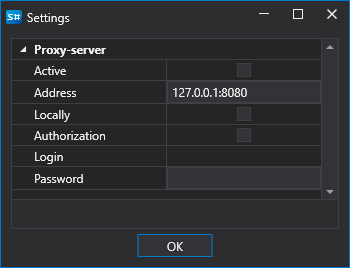

# Definições de ligações

1. Ao clicar na seta junto ao botão **Ligar** , aparece o botão **Definições de ligação**:

2. Ao clicar no botão **Definições de ligação**, abre-se a janela **Definições de ligação**, que está dividida em 3 áreas:

3. Clicar no botão  ativa a lista pendente de conectores suportados. Os conectores selecionados são apresentados na área n.º 1. O botão  remove o conector selecionado. A primeira coluna da área n.º 1 mostra se o conector irá ligar quando clicar no botão Connect  ou se não irá ligar . Estes valores são definidos através dos botões  e .

Os campos **Dados de mercado** e **Transações** mostram se o conector suporta dados de mercado e trabalho com ordens.

4. Quando a caixa de seleção **Auto-connect** está selecionada, a ligação é efetuada automaticamente quando o [Designer](../designer.md) é iniciado.

5. A área n.º 2 apresenta as definições do conector selecionado. Ao clicar em , o programa redireciona para a documentação ([API](../api.md)) sobre a configuração do conector selecionado.

  > [!IMPORTANT]
  > As **Advanced settings** são necessárias em casos especiais, e a sua alteração não é recomendada.

6. Clicar no botão **Verificar** irá verificar a ligação do conector atual. Se a verificação falhar, aparecerá uma janela com um erro, descrevendo o motivo da ligação sem êxito. Se a verificação for bem-sucedida, aparecerá uma janela:

7. A área n.º 3 apresenta os tipos de dados que serão recebidos ou transmitidos pelo conector. Ao clicar na caixa de seleção \/ , pode ativar\/desativar a transmissão ou receção para este tipo de dados.

8. Clicar no botão **Network settings** irá abrir a janela **Proxy-server settings**:

## Conteúdo recomendado

[Painel de estratégias](live_execution/strategies_dashboard.md)
