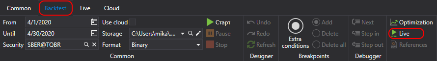

# Introdução

Para adicionar uma estratégia à **Negociação ao vivo**, no [Painel de esquemas](../user_interface/schemas.md), clique com o botão direito do rato na estratégia pretendida da pasta **Estratégias** e selecione  **Ao vivo**. A estratégia será adicionada à pasta **Ao vivo** do painel **Esquemas**.

Também pode adicionar uma estratégia à negociação ao vivo clicando no botão  **Ao vivo** no separador **Teste histórico**.

A pasta **Ao vivo** contém as estratégias adicionadas para execução em negociação ao vivo. As estratégias em execução são marcadas com o sinal , e as estratégias paradas com o sinal .

## Conteúdo recomendado

[Interface de utilizador](user_interface.md)
