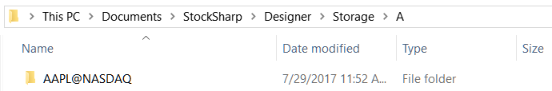
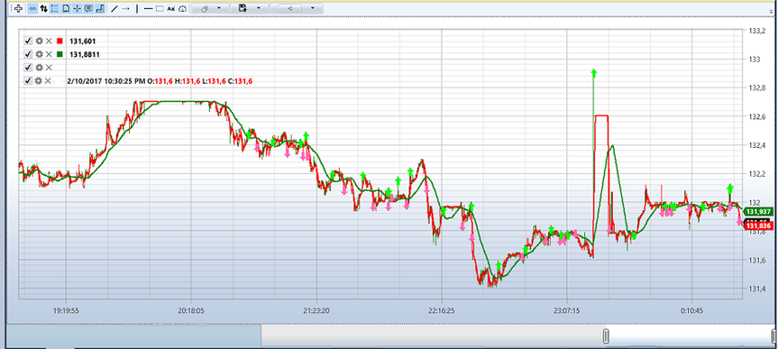

# Exemplo de execução em Live

Para executar um exemplo em **Ao vivo**, irá precisar de:

1. Terminal de teste **IB Trader Workstation (TWS) Demo** da [Interactive Brokers](../../api/connectors/stock_market/interactive_brokers.md), que pode obter no site do fabricante.

2. Configurar o terminal IB TWS Demo para funcionar com o [Designer](../../designer.md). Consulte **Exemplo de definições do IB TWS** na secção [Interactive Brokers](../../api/connectors/stock_market/interactive_brokers.md).

3. Configurar a ligação ao IB TWS Demo no [Designer](../../designer.md) e ligar.

4. Transferir o histórico para o instrumento necessário. Por exemplo, será usado o instrumento **AAPL@NASDAQ**. A estratégia utilizará candles com um time frame de 5 segundos e o histórico não será necessário, mas esse histórico será suficiente para demonstrar a possibilidade.

5. Configurar e executar a estratégia.

No exemplo com a estratégia SMA serão usados os seguintes parâmetros.

- Instrumento **AAPL@NASDAQ**
- Armazenamento padrão **\\Documents\\StockSharp\\Designer\\Storage**
- Formato de armazenamento - **CSV**
- Tipo de dados obtidos do armazenamento - **Tiques**
- Candles com time frame de 5 s
- Volume - 100
- Dias de histórico - 2

Depois de configurar todos os parâmetros necessários, inicie a live trading da estratégia clicando no botão  Start.

Depois de clicar no botão  Start, o gráfico começará a apresentar todo o histórico transferido dos 2 dias:

Depois de transferir todo o histórico do [Armazenamento de dados de mercado](../market_data_storage.md) e a tabela de negócios anónimos do terminal, a estratégia começará a negociar.

Abaixo estão os gráficos do [Designer](../../designer.md) e do terminal de negociação para o mesmo período.

Gráfico do [Designer](../../designer.md):

Gráfico do terminal de negociação:

## Consulte também

[Armazenamento de dados de mercado](../market_data_storage.md)
