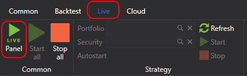

# Painel de estratégias

Ao clicar no botão  no separador **Ao vivo**, abre-se o painel **Ao vivo**.

O painel **Ao vivo** é uma tabela que apresenta todas as estratégias adicionadas a **Ao vivo**. No painel **Ao vivo**, pode ver o estado atual da estratégia e executar ou parar a estratégia usando os botões , .

- A primeira coluna é responsável por iniciar/parar a estratégia.
- A segunda coluna destina-se às definições da estratégia.
- **Em linha** indica se todos os indicadores da estratégia estão formados e se todas as subscrições transitaram para um [estado](../../api/market_data/subscriptions.md) **Em linha**.
- **Negociação** permite alterar as operações disponíveis. Por exemplo, proibir a abertura de novas posições ou o aumento de posições existentes.
- **Posição** mostra a posição atual para o instrumento da estratégia. Clicar no botão da cruz fecha a posição.
- As outras colunas apresentam as estatísticas de negociação atuais da estratégia.

Fazer duplo clique numa linha selecionada abrirá o painel com a estratégia.

## Conteúdo recomendado

[Exemplo de execução ao vivo](live_execution_sample.md)
