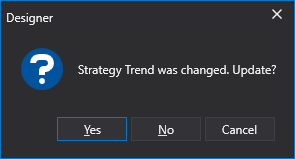

# Interface

Depois de adicionar uma estratégia à pasta **Ao vivo**, ao fazer duplo clique na estratégia adicionada, abre-se um separador intitulado "Live [Strategy Name]". Ao navegar para este separador, o separador **Ao vivo** abre-se automaticamente no **Faixa de opções**. No separador **Ao vivo**, pode especificar o instrumento e o portefólio com os quais a estratégia irá trabalhar. Ao premir o botão **Iniciar**, inicia a live trading para a estratégia; ao premir o botão **Parar**, interrompe-a.

O separador da estratégia contém o designer de estratégias para esquemas e elementos de componentes, semelhante ao descrito em [Designer de estratégias](../strategies/using_visual_designer/diagram_panel.md). Além disso, o separador inclui o painel [Definições de negociação em tempo real](../user_interface/components/live_settings.md), que por predefinição está recolhido e anexado ao lado direito do separador.

Adicionar uma estratégia a **Ao vivo** implica copiá-la do código original (no caso de usar [esquemas](../strategies/using_visual_designer.md) ou [código](../strategies/using_code.md)). Por isso, as alterações ao algoritmo dentro da cópia **Ao vivo** não afetam o original. Ao iniciar a estratégia, se houver uma discrepância entre **Ao vivo** e o original, será apresentado um aviso:

- **Sim** significa aplicar as alterações do original à cópia **ao vivo**.
- **Não** significa ignorar a diferença e iniciar a cópia **ao vivo** sem aplicar alterações.
- **Cancelar** significa não iniciar nada.

As alterações na cópia **Ao vivo** devem ser mínimas, destinadas a testes e posterior transferência para o original. Caso contrário, existe o risco de perder alterações se a cópia **Ao vivo** for atualizada para a versão do original.

## Consulte também

[Definições de ligação](../connections_settings.md)
