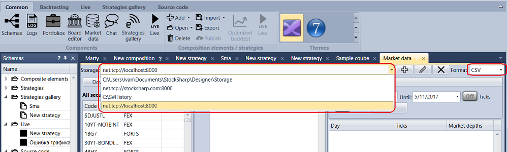

# Introdução

Para criar um armazenamento de dados históricos, clique no botão  no separador **Market data**. Clique em  para alterar os parâmetros do armazenamento atual. Clique em  para eliminar o armazenamento atual da lista de armazenamentos.

O armazenamento de dados históricos pode ser local ou remoto.

Armazenamento local - quando todos os dados são guardados no computador local. Para configurar o armazenamento local, basta indicar o caminho para a pasta com os dados armazenados.

O armazenamento remoto pode estar localizado noutro computador. Para o configurar, especifique o endereço do armazenamento remoto e, se necessário, o login e a palavra-passe.

Pode reproduzir o armazenamento remoto numa máquina local usando o software [Hydra](../../hydra.md) (nome de código Hydra), concebido para o carregamento automático de dados de mercado (instrumentos, candles, tick trades e livros de ordens, etc.) de várias fontes e para os armazenar no armazenamento local. Para isso, coloque o [Hydra](../../hydra.md) em modo de servidor.

Depois disso, no [Designer](../../designer.md), crie um novo armazenamento clicando no botão . Nas definições de armazenamento, no campo de endereço, especifique "net.tcp:\/\/localhost:8000". Clique em OK. Ao usar o [Hydra](../../hydra.md) como armazenamento remoto, não se esqueça de que o [Hydra](../../hydra.md) deve estar iniciado e configurado em conformidade.

Depois de adicionar um novo armazenamento, este pode ser selecionado na lista pendente **Storage**.

Também tem de selecionar o formato dos ficheiros de armazenamento - BIN ou CSV. Os dados podem ser guardados em dois formatos: num formato binário especial BIN, que proporciona a taxa máxima de compressão, ou no formato de texto CSV, que é conveniente ao analisar dados noutros programas. O formato BIN é preferível quando há necessidade de poupar espaço em disco. O formato CSV é preferível quando há necessidade de ajustar dados manualmente. O CSV é facilmente editado pelo bloco de notas padrão, MS Excel, etc.

## Conteúdo recomendado

[Transferir instrumentos](download_instruments.md)
