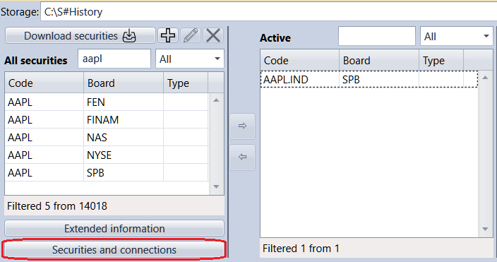

# Mapeamento de símbolos

O mesmo instrumento em diferentes sistemas de negociação pode ter nomes diferentes. No **Designer**, é possível associar o instrumento e as ligações através das quais esse instrumento será negociado, e indicar como ele é identificado no sistema de negociação externo. Isto é útil ao negociar um instrumento em diferentes mercados de negociação ou através de diferentes ligações (ou brokers). Também permite receber dados de uma ligação e efetuar negócios através de outra ligação.

Para associar títulos e ligações, clique no botão **Instrumentos e ligações** no painel **Todos os instrumentos**.

Na janela aberta, clique no botão  para adicionar uma nova linha.

Na coluna **Ligação**, selecione uma ligação na lista pendente. Nas colunas **Código do instrumento** e **Código do mercado**, especifique os códigos do título e do mercado tal como estão especificados no **Designer**. Nas colunas **Código do adaptador** e **Mercado do adaptador**, especifique os códigos do título e do mercado tal como estão especificados no sistema de negociação externo.

