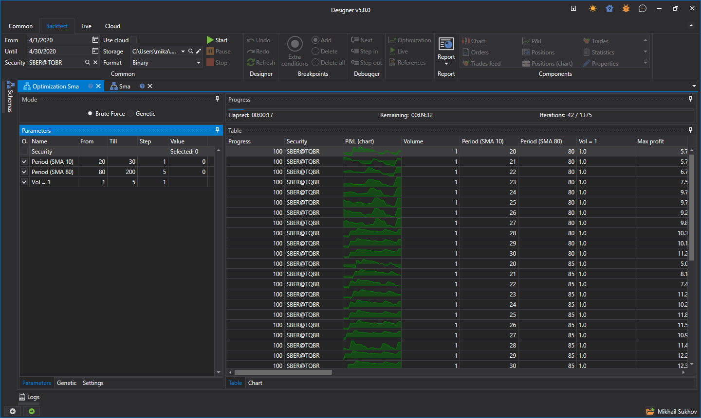

# Brute-force

Para mudar para o modo de otimização de estratégia, clique no botão **Optimization** no separador **Emulation**. O exemplo de otimização será considerado usando a estratégia SMA criada [a partir de cubos](../strategies/using_visual_designer/first_strategy.md).

Será aberto no espaço de trabalho um separador chamado Optimization + 'Strategy Name'. O separador **Optimization** está dividido em duas áreas, **Properties** e **Optimization Result**:

- A área **Properties** consiste em separadores com várias tabelas. A primeira contém os parâmetros da estratégia, que são [iterados](optimization_parameters.md). A segunda contém as definições de [genética](genetic.md). A terceira contém as definições de sistema do otimizador. Por exemplo, aí pode alterar o número de threads e núcleos envolvidos na otimização.
- A área **Optimization Result** é uma tabela em que cada linha é o resultado do teste da estratégia com parâmetros únicos. Além disso, na área **Optimization Result**, existe uma barra de progresso que mostra o progresso da otimização, o tempo decorrido e o tempo estimado até ao fim da otimização. Adicionalmente, existe um separador para apresentar os resultados sob a forma de um [gráfico 3D](3d_chart.md).

A definição dos parâmetros para iteração resulta em mais de 1000 iterações. Depois de iniciar o otimizador, o progresso na parte superior, acima dos resultados, mostrará dados sobre o número planeado de iterações, quantas já foram concluídas e quanto tempo será aproximadamente necessário até à conclusão:

## Consulte também

[Exemplo de backtesting](../backtesting/getting_started.md)
