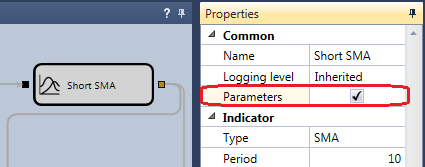

# Parâmetros de otimização

A otimização é realizada sobre parâmetros da estratégia que tenham os seguintes tipos:

- Numéricos (inteiros e fracionários)
- Tempo ([TimeSpan](xref:System.TimeSpan))
- Valor booleano (True-False)
- Valor [Unit](../../api/strategies/unit_type.md)

Por predefinição, todos os parâmetros com estes tipos aparecem na [tabela de parâmetros do otimizador](brute_force.md). Para excluir um parâmetro da otimização:

- Para um [diagrama](../strategies/using_visual_designer.md), selecione o cubo necessário, abra as suas propriedades, mude para **Advanced settings** e desative a caixa **Parameter**:



- No caso de [código](../strategies/using_code.md), é necessário escrever código ao definir um parâmetro e alterar a propriedade [CanOptimize](xref:StockSharp.Algo.Strategies.IStrategyParam.CanOptimize):

```cs
_long = this.Param(nameof(Long), 80);
_short = this.Param(nameof(Short), 20);
			
// desativar o parâmetro para otimização
_long.CanOptimize = false;
```

Depois de alterar os parâmetros de otimização disponíveis, reabra o [painel de otimização](brute_force.md).
