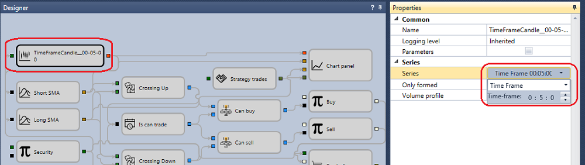

# Início rápido

No primeiro arranque, o [Designer](../designer.md) abre o diagrama de estratégia de médias móveis pré-configurado.

Para o executar em dados históricos, é necessário descarregar os dados no formato correto. Recomendamos usar o [Hydra](../hydra.md), um programa concebido para carregar automaticamente dados de mercado (instrumentos, candles, negócios por tick, livros de ordens e outros dados) a partir de diferentes fontes e guardá-los no armazenamento local. O descarregamento e armazenamento de dados históricos são descritos em detalhe em [Armazenamento de dados de mercado](market_data_storage.md).

Depois de os dados serem descarregados com o [Hydra](../hydra.md), indique a pasta onde o [Hydra](../hydra.md) guardou o histórico no [Designer](../designer.md). Isto é configurado no separador **Teste histórico** -> **Armazenamento**.

Ao clicar em , é aberta a janela **Definições de armazenamento de dados**, onde pode configurar armazenamento local ou remoto. Também pode configurar o [Hydra](../hydra.md) [em modo de servidor](../hydra/server_mode/settings.md) como fonte de dados de mercado. Ao clicar no **botão do repositório**, é aberta a janela de seleção de pasta. Selecione a pasta onde guardou anteriormente o histórico descarregado pelo [Hydra](../hydra.md).

Agora obtenha os instrumentos e os respetivos dados a partir do armazenamento local configurado. Aceda ao separador **Geral** e selecione o componente **Dados de mercado**.

É aberto o separador de gestão de dados de mercado. Para obter os instrumentos disponíveis, clique em [Transferir instrumentos](market_data_storage/download_instruments.md). Para descarregar um instrumento, introduza o seu código ou selecione a opção **Todos**, escolha a fonte de dados e clique em **Confirmar**. O [Designer](../designer.md) solicita os instrumentos disponíveis à fonte de dados. Todos os instrumentos encontrados aparecem no painel **Todos os instrumentos**.

Agora o [Designer](../designer.md) pode usar os instrumentos descarregados e os dados históricos disponíveis no armazenamento. Escolha uma das estratégias de demonstração. No [Painel de esquemas](user_interface/schemas.md), abra a pasta **Estratégias** e faça duplo clique na estratégia de exemplo **SMA**. O separador **Sma** aparece na área de trabalho. Depois de mudar para a estratégia, a faixa abre automaticamente o separador **Teste histórico**, que contém os principais controlos para criar, depurar e testar estratégias ([Criar estratégias](strategies/using_visual_designer.md), [Exemplo de teste histórico](backtesting/getting_started.md)).

No separador **Teste histórico**, defina o período de teste, selecione o instrumento e escolha o [Armazenamento de dados de mercado](market_data_storage.md).

Ao clicar em  no campo **Instrumento**, é aberta a janela **Selecionar instrumento**. Selecione nesta janela o instrumento necessário.

Quando seleciona qualquer bloco no painel **Designer**, o painel **Propriedades** mostra as propriedades desse bloco. No painel **Propriedades** do bloco **Velas**, pode configurar o tipo de vela e o período ([Velas](../api/candles.md)).

Depois de clicar em **Iniciar**, começa a emulação de negociação. Os resultados do teste ficam disponíveis nos separadores correspondentes do diagrama: Gráfico, Ordens, Negócios, P/L, Posições (gráfico), Estatísticas e Posições.

