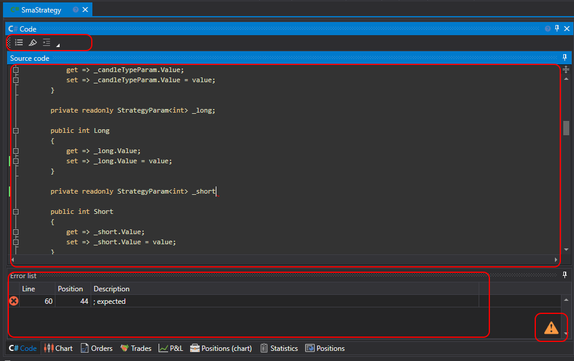

# Usar C#

A criação de estratégias a partir de código destina-se a utilizadores que preferem trabalhar com código C#. Ao contrário dos diagramas, estas estratégias não são limitadas em capacidades, e qualquer algoritmo pode ser descrito.

O processo de criação de uma estratégia ocorre diretamente no [Designer](../../../designer.md) ou num ambiente de desenvolvimento **C#** (os mais populares são **Visual Studio** e **JetBrains Rider**), usando uma biblioteca para o desenvolvimento profissional de robôs de negociação em **C#** e a [API](../../../api.md).

Pode adicionar uma nova estratégia premindo o botão **Adicionar**  no separador **Comum** e escolhendo **Estratégia**. Ou clicando com o botão direito na pasta **Estratégias** no painel **Esquema** e premindo o botão **Adicionar**  no menu pendente:

Depois de premir o botão **Adicionar** , aparecerá uma janela com a escolha do tipo de conteúdo para criar a estratégia:

Para criar uma estratégia a partir de código C#, é necessário selecionar o segundo separador. Também pode escolher um modelo que será usado como código inicial.

Depois de premir **OK**, uma nova estratégia aparecerá na pasta **Estratégias** do painel **Esquema**, de forma semelhante à criação de uma estratégia a partir de [diagramas](../using_visual_designer.md). As ações para eliminar ou mudar o nome da estratégia também são semelhantes.

Mas, em vez de um diagrama, será apresentado um editor de código C#:

O separador do editor de código é composto pelos painéis **Source Code** e **Error List**. O painel **Source Code** contém o próprio editor de código C#. Na parte superior, existe uma barra de ferramentas onde é possível ativar ou desativar o destaque de elementos como **Current Line**, **Line Number**, etc. Para aumentar o tamanho da letra, pode usar a combinação CTRL+MouseWheel.

O painel **Error List** é uma tabela com uma lista de erros no código; um duplo clique numa linha move automaticamente o cursor no painel **Source Code** para a localização do erro.

Ao editar o código, aparecerá um ícone  no canto inferior direito do painel **Error List**, indicando que o acompanhamento de alterações começou. O código é compilado no momento em que deixa de mudar.

Executar a estratégia em [backtest](../../backtesting/user_interface.md), em [live](../../live_execution/getting_started.md) e outras operações é semelhante ao funcionamento de uma estratégia criada a partir de diagramas.
