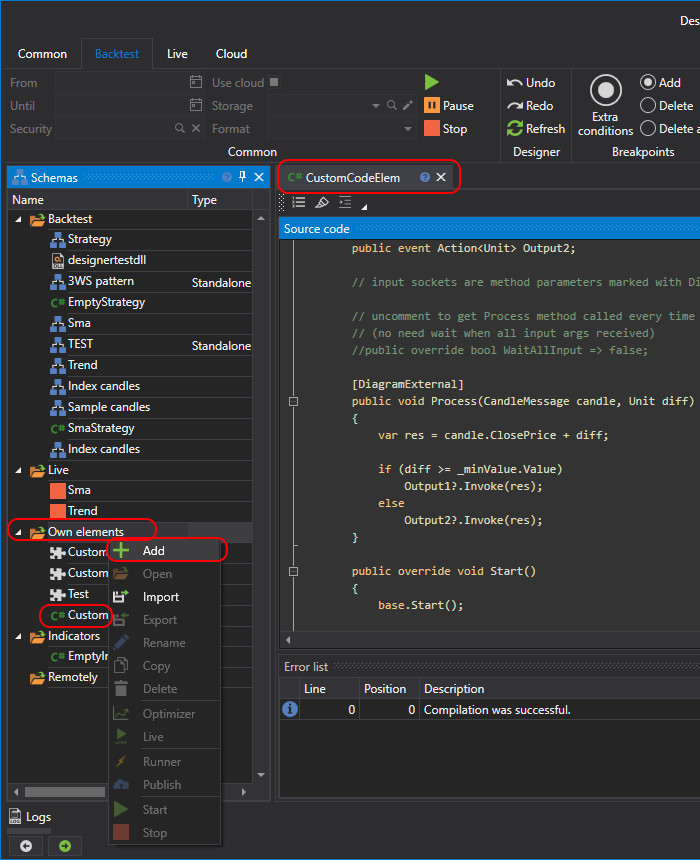

# Criar o seu próprio cubo

Tal como ao criar um [cubo a partir de um diagrama](../../using_visual_designer/composite_elements.md), pode criar o seu próprio cubo com base em código C#. Esse cubo será mais funcional do que um cubo criado a partir de um diagrama.

Para criar um cubo a partir de código, este deve ser criado na pasta **Elementos próprios**:



No exemplo apresentado abaixo, o cubo herda da classe [DiagramExternalElement](xref:StockSharp.Diagram.DiagramExternalElement) e tem o seguinte aspeto:

```cs
/// <summary>
/// Elemento de diagrama de exemplo que demonstra a utilização de conectores de entrada e saída.
///
/// https://doc.stocksharp.com/topics/Designer_Combine_Source_code_and_standard_elements.html
/// </summary>
public class EmptyDiagramElement : DiagramExternalElement
{
	private readonly DiagramElementParam<int> _minValue;

	public EmptyDiagramElement()
	{
		// propriedade de exemplo para mostrar como criar parâmetros

		_minValue = AddParam("MinValue", 10)
			.SetBasic(true) // tornar o parâmetro visível no modo básico
			.SetDisplay("Parâmetros", "Valor mínimo", "Descrição do parâmetro de valor mínimo", 10);
	}

	// conectores de saída são eventos marcados com o atributo DiagramExternal

	[DiagramExternal]
	public event Action<Unit> Output1;

	[DiagramExternal]
	public event Action<Unit> Output2;

	// conectores de entrada são parâmetros de métodos marcados com o atributo DiagramExternal

	// descomente para que o método Process seja chamado sempre que for recebido um novo argumento
	// (não é necessário esperar até todos os argumentos de entrada serem recebidos)
	//public override bool WaitAllInput => false;

	[DiagramExternal]
	public void Process(CandleMessage candle, Unit diff)
	{
		var res = candle.ClosePrice + diff;

		if (diff >= _minValue.Value)
			Output1?.Invoke(res);
		else
			Output2?.Invoke(res);
	}

	public override void Start()
	{
		base.Start();

		// adicionar lógica antes do arranque
	}

	public override void Stop()
	{
		base.Stop();

		// adicionar lógica depois da paragem
	}

	public override void Reset()
	{
		base.Reset();

		// adicionar lógica para repor o estado interno
	}
}
```

Neste código, o cubo tem dois conectores de entrada e dois conectores de saída. Os conectores de entrada são definidos aplicando o atributo [DiagramExternalAttribute](xref:StockSharp.Diagram.DiagramExternalAttribute) ao método:

```cs
[DiagramExternal]
public void Process(CandleMessage candle, Unit diff)
```

Os conectores de saída são definidos aplicando o atributo a um evento. No exemplo do cubo, existem dois eventos deste tipo:


```cs
[DiagramExternal]
public event Action<Unit> Output1;

[DiagramExternal]
public event Action<Unit> Output2;
```

Por isso, existirão também dois conectores de saída.

Além disso, é mostrado como criar uma propriedade para o cubo:

```cs
_minValue = AddParam("MinValue", 10)
	.SetBasic(true) // tornar o parâmetro visível no modo básico
	.SetDisplay("Parâmetros", "Valor mínimo", "Descrição do parâmetro de valor mínimo", 10);
```

A utilização da classe [DiagramElementParam](xref:StockSharp.Diagram.DiagramElementParam`1) aplica automaticamente a abordagem de guardar e restaurar definições.

A propriedade **Valor mínimo** está marcada como básica e ficará visível no modo [Propriedades básicas](../../using_visual_designer/diagram_panel.md).

A propriedade comentada [WaitAllInput](xref:StockSharp.Diagram.DiagramExternalElement.WaitAllInput) é responsável pelo momento da chamada do método com conectores de entrada:

```cs
//public override bool WaitAllInput => false;
```

Se for descomentada, o método **Processo** será sempre chamado assim que pelo menos um valor chegar (no caso do exemplo, uma candle ou um valor numérico).

Para adicionar o cubo resultante ao diagrama, é necessário selecionar o cubo criado na paleta, na secção **Elementos próprios**:


> [!WARNING]
> Cubos em código C# não podem ser usados em estratégias criadas em código C#. Só podem ser usados em estratégias criadas [a partir de cubos](../../using_visual_designer.md).

## Ver também

[Criar um indicador](create_own_indicator.md)
