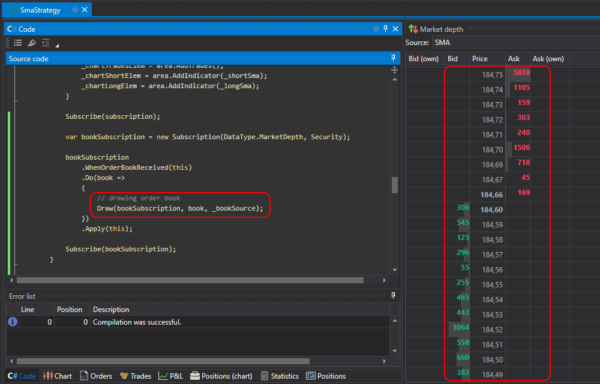

# Desenhar o livro de ordens

Uma estratégia criada a partir de código pode desenhar dados no painel [Livro de ordens](../../../user_interface/components/order_book.md), de forma semelhante ao cubo [Painel de livro de ofertas](../../using_visual_designer/elements/market_depths/order_book_panel.md). Para isso, é necessário escrever o seguinte código.

1. Crie um descendente da interface [IOrderBookSource](xref:StockSharp.Algo.Strategies.IOrderBookSource), que o **Designer** usa para identificar a fonte. No exemplo, é usada a classe [OrderBookSource](xref:StockSharp.Algo.Strategies.OrderBookSource), que é a implementação predefinida da interface:

```cs
private static readonly OrderBookSource _bookSource = new OrderBookSource("SMA");
```

2. Substitua a propriedade [OrderBookSources](xref:StockSharp.Algo.Strategies.Strategy.OrderBookSources):

```cs
public override IEnumerable<IOrderBookSource> OrderBookSources
	=> new[] { _bookSource };
```

Assim, a estratégia indicará ao código externo (neste caso, o painel [Livro de ordens](../../../user_interface/components/order_book.md)) quais as fontes de livros de ordens disponíveis. A multiplicidade de fontes ocorre quando a estratégia trabalha com vários livros de ordens (instrumentos diferentes, ou livros de ordens com várias modificações, como, por exemplo, um [livro de ordens afinado](../../using_visual_designer/elements/market_depths/sparse_order_book.md)).

3. Adicione a inicialização da subscrição ao livro de ordens no código da estratégia. No caso de SmaStrategy, ela é adicionada ao fim do método [OnStarted](xref:StockSharp.Algo.Strategies.Strategy.OnStarted):

```cs
var bookSubscription = new Subscription(DataType.MarketDepth, Security);
			
bookSubscription
	.WhenOrderBookReceived(this)
	.Do(book =>
	{
		// desenhar o livro de ordens
		DrawOrderBook(bookSubscription, _bookSource, book);
	})
	.Apply(this);
			
Subscribe(bookSubscription);
```

No manipulador Do, é feita uma chamada ao método [DrawOrderBook](xref:StockSharp.Algo.Strategies.Strategy.DrawOrderBook(StockSharp.BusinessEntities.Subscription,StockSharp.Algo.Strategies.IOrderBookSource,StockSharp.Messages.IOrderBookMessage)), que envia o livro de ordens para desenho.

4. Adicione o painel [Livro de ordens](../../../user_interface/components/order_book.md) e selecione a fonte criada no código:

  

5. Depois de lançar a estratégia para teste, o livro de ordens será preenchido com dados:

  
