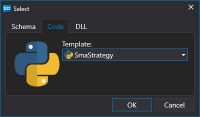

# Usar Python

A criação de estratégias a partir de código destina-se a utilizadores que preferem trabalhar com código Python. Ao contrário dos esquemas, estas estratégias não são limitadas em capacidades, e qualquer algoritmo pode ser implementado.

O processo de criação de uma estratégia ocorre diretamente no [Designer](../../../designer.md) ou num ambiente de desenvolvimento **Python** (os ambientes de desenvolvimento mais populares são **Visual Studio** e **JetBrains Rider**), usando a biblioteca para o desenvolvimento profissional de robôs de negociação em **Python** e a [API](../../../api.md).

Pode adicionar uma nova estratégia clicando no botão **Adicionar**  no separador **Geral** e selecionando **Estratégia**. Ou clicando com o botão direito na pasta **Estratégias** no painel **Esquemas** e clicando no botão **Adicionar**  no menu pendente:

Depois de clicar no botão **Adicionar** , aparecerá uma janela com a escolha do tipo de conteúdo sobre o qual criar a estratégia:

Para criar uma estratégia a partir de código Python, selecione o segundo separador. Também pode escolher um modelo que será usado como código inicial.

Depois de clicar em **Confirmar**, uma nova estratégia aparecerá na pasta **Estratégias** do painel **Esquemas**, de forma semelhante à criação de uma estratégia a partir de um [esquema](../using_visual_designer.md). As ações para eliminar ou mudar o nome da estratégia também são semelhantes.

Mas, em vez de um esquema, será apresentado um editor de código Python:

O separador do editor de código é composto pelos painéis **Código-fonte** e **Lista de erros**. O painel **Código-fonte** contém o próprio editor de código Python. Na parte superior, existe uma barra de ferramentas onde pode ativar ou desativar o destaque de elementos como **Linha atual**, **Número da linha**, etc. Para aumentar o tamanho da letra, pode usar a combinação CTRL+MouseWheel.

O painel **Lista de erros** é uma tabela com uma lista de erros no código; um duplo clique numa linha move automaticamente o cursor no painel **Código-fonte** para a localização do erro.

Ao editar o código, aparecerá um ícone  no canto inferior direito do painel **Lista de erros**, indicando que o acompanhamento de alterações começou. A compilação do código ocorre quando o código deixa de mudar.

Executar a estratégia em [backtest](../../backtesting/user_interface.md), em [live](../../live_execution/getting_started.md) e outras operações funciona de forma semelhante às estratégias criadas a partir de esquemas.

## Limitações

> [!WARNING]
> O [Designer](../../../designer.md) usa IronPython, que tem as seguintes limitações:
> - Compatibilidade com a versão 3.4 do Python
> - Suporte parcial para numpy através de uma implementação especial em .NET (pode encontrar um exemplo de utilização [aqui](https://github.com/StockSharp/StockSharp/blob/master/Algo.Analytics.Python/pearson_correlation_script.py))
> - Falta de suporte para outras bibliotecas populares escritas em C (pandas, scipy, etc.)
> - Suporte limitado para programação assíncrona
> - Impossibilidade de usar determinados módulos Python incorporados devido à dependência de implementações específicas do CPython
> - O desempenho pode ser inferior ao do CPython em algumas operações
>
> Recomenda-se considerar estas limitações ao desenvolver estratégias de negociação em Python no [Designer](../../../designer.md).
