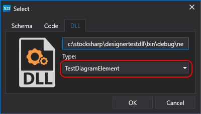

# Criar um cubo e um indicador

O algoritmo para criar um cubo ou indicador a partir de um assembly DLL é semelhante ao processo a partir de código (ver a criação de um [cubo](../using_code/csharp/creating_your_own_cube.md) e de um [indicador](../using_code/csharp/create_own_indicator.md)), exceto na etapa de seleção de conteúdo. De forma semelhante, ao adicionar uma [estratégia a partir de DLL](../using_dll.md), pode escolher tanto o tipo de cubo como o tipo de indicador, se estes tiverem sido criados na DLL ligada:

Ao criar um indicador, inclua o pacote NuGet [StockSharp.Algo](https://www.nuget.org/packages/stocksharp.algo) para compilar o código. Ele contém a classe base para todos os indicadores: [BaseIndicator](xref:StockSharp.Algo.Indicators.BaseIndicator).

Ao criar um cubo, inclua o pacote NuGet [StockSharp.Diagram.Core](https://www.nuget.org/packages/stockSharp.diagram.core) para compilar o código. Ele contém a classe base para todos os cubos: [DiagramExternalElement](xref:StockSharp.Diagram.DiagramExternalElement).

Ao adicionar cubos ou indicadores ligados ao diagrama, tem de seguir os passos descritos nas secções de [cubo](../using_code/csharp/creating_your_own_cube.md) ou [indicador](../using_code/csharp/create_own_indicator.md).

## Ver Também

[Depurar uma DLL com o Visual Studio](debug_dll_in_visual_studio.md)
