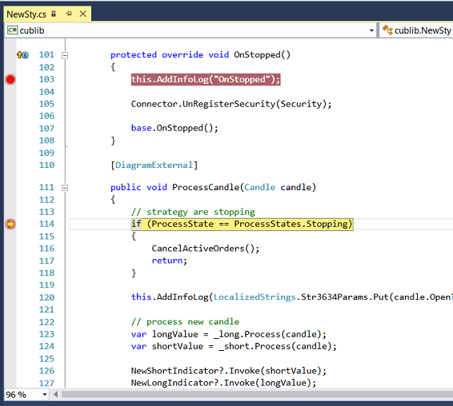

# Depurar uma DLL com o Visual Studio

O Visual Studio fornece um mecanismo para anexar a processos em execução usando o depurador do Visual Studio. O depurador do Visual Studio é descrito com mais detalhe na documentação [Anexar a processos em execução](https://learn.microsoft.com/en-us/visualstudio/debugger/attach-to-running-processes-with-the-visual-studio-debugger?view=vs-2022). O processo de depuração será demonstrado usando o exemplo de uma estratégia adicionada na secção [Usar DLL](../using_dll.md).

1. Para anexar a um processo e iniciar a depuração de uma estratégia DLL, esta tem de ser carregada em memória. A DLL é carregada em memória depois de [adicionar a estratégia](../using_dll.md). Assim que a DLL estiver carregada em memória, pode anexar ao processo.

2. No Visual Studio, selecione **Debug -> Attach to Process**.

3. Na caixa de diálogo **Anexar ao processo**, encontre o processo **Designer.exe** na lista **Processos disponíveis** ao qual pretende anexar.

Se o processo estiver em execução com outra conta de utilizador, tem de marcar a caixa **Mostrar processos de todos os utilizadores**.

4. É importante que a janela **Anexar a** especifique o tipo de código que tem de ser depurado. O parâmetro predefinido **Automático** tenta determinar o tipo de código a depurar, mas nem sempre identifica corretamente o tipo de código. Para definir manualmente o tipo de código, tem de executar os seguintes passos.

- No campo Attach to, clique em **Selecionar**.
- Na caixa de diálogo **Selecionar tipo de código**, clique no botão **Depurar estes tipos de código** e selecione os tipos para depuração.
- Clique em OK.

5. Clique no botão Attach.

6. No Visual Studio, defina pontos de interrupção no código. Se os pontos de interrupção estiverem vermelhos e preenchidos a vermelho  (e o Studio estiver em modo de depuração), isso significa que foi carregada a versão exata da DLL. Se os pontos de interrupção estiverem vermelhos e preenchidos a branco  (e o Studio estiver em modo de depuração), isso significa que foi carregada a versão errada da DLL.

7. No exemplo, o ponto de interrupção é definido na primeira linha do método **public void ProcessCandle(Candle candle)**. Quando a estratégia é executada no [Designer](../../../designer.md), assim que os valores das velas começarem a ser passados para a DLL, o Visual Studio irá parar no ponto de interrupção. A partir daí, pode acompanhar a execução do código:

> [!WARNING]
> Quando o código está parado no depurador, todos os processos dentro do programa **Designer** ficam suspensos. Se o programa estiver ligado a negociação real, então, no caso de uma paragem longa no depurador, ocorrerão desconexões.

## Ver Também

[Exportação de estratégias](../../export_import/export.md)
