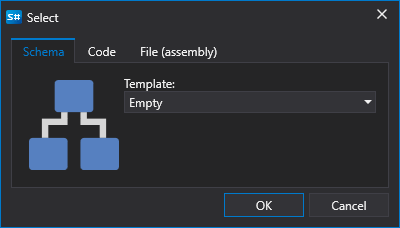

# Usar blocos

Usar blocos não requer competências de programação. O processo de criação de uma estratégia consiste em combinar blocos e ligações (linhas), representando visualmente todo o fluxo de trabalho.

Pode adicionar uma nova estratégia premindo o botão **Adicionar**  no separador **Geral** e escolhendo **Estratégia**. Ou clicando com o botão direito do rato na pasta **Estratégias** no painel **Esquemas** e premindo o botão **Adicionar**  no menu pendente:

Depois de premir o botão **Adicionar** , aparecerá uma janela com a escolha do tipo de conteúdo para criar a estratégia:

Para criar uma estratégia a partir de blocos, tem de selecionar o separador **Esquema**. Também pode escolher um modelo que será usado como esquema inicial.

Depois de premir **Confirmar**, aparecerá uma nova estratégia na pasta **Estratégias** do painel **Esquemas**. Surgirá um novo separador com a estratégia na área de trabalho e, ao navegar para ele, o separador **Teste histórico** será aberto automaticamente no friso. No painel **Esquemas**, clicar com o botão direito do rato na estratégia abre um menu que permite renomear a estratégia, entre outras ações.

O separador da estratégia é composto pelo painel **Esquema** ([Designer de estratégias](using_visual_designer/diagram_panel.md)), bem como por outros separadores que representam os [componentes gráficos](../user_interface/components.md) da estratégia, necessários para apresentar os resultados do teste da estratégia criada na área **Esquema**. As informações detalhadas sobre testes de estratégias são descritas na secção [Exemplo de testes históricos](../backtesting/getting_started.md).

## Ver também

[Designer de estratégias](using_visual_designer/diagram_panel.md)
